# ch1. 安裝 SUSE Linux Enterprise Server 15

如何在 VMware Workstation 建立虛擬機，並完成 SUSE Linux Enterprise Server 15 SP7（SLES 15 SP7）的安裝。內容涵蓋 SUSE 歷史背景、硬體需求、ISO 下載、VM 設定，以及安裝精靈各步驟的意義與建議選項。

---

## 1-1. SUSE 簡介

SUSE（Software und System-Entwicklung）是最早的商業 Linux 發行版之一，起源於德國，在歐洲與企業級市場具有深厚影響力。理解其演進有助於掌握為何 SLES 強調穩定、長期支援，以及 YaST 在系統管理中的核心地位。

### 早期成立與德語市場開拓（1992 – 1990 年代末）

- **1992 年**：由 Roland Dyroff、Thomas Fehr、Burchard Steinbild、Hubert Mantel 於德國紐倫堡成立。初期為 UNIX 顧問公司，並為德語市場銷售 UNIX 工具與發行版（如 Slackware，以及修改自 SLS 的 S.u.S.E. Linux 0.98）。
- **1994 年**：發布第一個完整發行版 S.u.S.E. Linux 1.0（基於 Slackware 並德語化）。這標誌著從「販售他人發行版」轉向「發展自有發行版」。
- **1996 年**：發布第一個完全獨立開發的 S.u.S.E. Linux 4.2，並引入 **YaST**（Yet another Setup Tool）。YaST 讓複雜的系統設定變得較直觀，成為 SUSE 長期標誌性特色。

### 商業化與企業級市場擴張（2000 年代初期）

- **2000 年**：成為第一家在 IBM 大型主機上提供 Linux 支援的企業，顯示其企業市場野心。
- **2001 年**：企業產品線更名為 **SUSE Linux Enterprise Server（SLES）**，明確區分伺服器／企業客戶路線。SLES 以穩定性、可靠性、長期支援與硬體相容性著稱。

### 所有權變遷與持續發展（2000 年代中期 – 至今）

- **2003 年**：被 Novell 收購，獲得更多資源與市場機會。
- **2005 年**：推出 **openSUSE** 計畫，將開發過程向社群開放（類似 Red Hat 與 Fedora 的關係）。
  - **openSUSE Leap**：較接近企業穩定路線
  - **openSUSE Tumbleweed**：Rolling Release，提供最新軟體
- **2011 年**：Novell（含 SUSE）被 Attachmate Group 收購；SUSE 以獨立業務部門運作。
- **2014 年**：Attachmate Group 被 Micro Focus 收購；SUSE 再次成為旗下業務單位。
- **2018 年**：被 EQT Partners 收購，成為完全獨立軟體公司。
- **2021 年**：於法蘭克福證券交易所上市。

### 學習心得

- SLES 的產品哲學是「企業可用、長期可維護」，而非追求最新套件。
- YaST 與模組化（Module）設計，是後續安裝與日常管理會反覆使用的核心概念。
- openSUSE 可作為接近 SLES 的免費練習環境；正式企業部署仍以 SLES 訂閱與支援為主。

### 練習：SUSE 簡介

1. 說明 YaST 出現的時間點，以及它對 SUSE 產品定位的意義。
2. 比較 openSUSE Leap 與 openSUSE Tumbleweed 的差異。
3. 用時間軸整理 2003、2005、2018、2021 對 SUSE 的關鍵影響。

---

## 1-2. Hardware（硬體需求）

安裝前先確認資源是否滿足官方最低需求，可避免安裝中途失敗或系統過慢。

### CPU

- 支援該版本發行時市面上絕大多數處理器。
- 在 **Intel 64 / AMD64** 架構下，軟體設計理論上最大可支援達 **8,192** 顆 CPU。
- **實務建議（學習用 VM）**：2 核心即可應付 Minimal 安裝與基礎練習。

### RAM

| 情境                     | 需求                           |
| ------------------------ | ------------------------------ |
| 最小安裝最低需求         | 1,024 MB（1 GB）               |
| 超過 2 核心時            | 每增加 1 核心，額外配置 512 MB |
| 透過 HTTP / FTP 遠端安裝 | 額外外加 150 MB                |
| GNOME 桌面最低           | 2,048 MB（2 GB）               |
| GNOME 官方推薦           | 4,096 MB（4 GB）               |

- **學習意義**：Minimal / Text Mode 可較省記憶體；若未來要開桌面或同時跑多服務，應預留更多 RAM。
- **本筆記 VM 範例**：配置 **4096 MB**，對學習環境較寬裕。

### Hard Disk

| Installation   | Minimum Hard Disk Requirements |
| -------------- | ------------------------------ |
| Text Mode      | 1.5 GB                         |
| Minimal System | 2.5 GB                         |
| GNOME Desktop  | 3 GB                           |
| All patterns   | 4 GB                           |

- 上述為「最低可安裝」參考值；實際還需保留日誌、套件快取、未來服務資料空間。
- **本筆記 VM 範例**：虛擬磁碟設為 **50 GB**，避免後續練習空間不足。

### 學習心得

- 最低需求只保證「裝得起來」，不代表「用得舒服」。
- 伺服器角色、桌面環境、快照與日誌量，都會快速吃掉 RAM 與 Disk。
- 在 Hypervisor 中寧可先給足資源，再依監控結果向下調整。

### 練習：Hardware

1. 規劃一台 Minimal SLES 練習機，寫出建議的 CPU / RAM / Disk，並說明理由。
2. 解釋為何「遠端安裝」需要額外記憶體。
3. 若同時開啟 GNOME 與多個服務，應優先擴充 RAM 還是 Disk？為什麼？

---

## 1-3. 下載安裝媒體

官方下載頁：

- [SUSE Linux Enterprise Server - Downloads](https://www.suse.com/download/sles/)

### 步驟與意義

1. **前往官方下載頁**  
   確保取得正式、可驗證的安裝媒體，避免來路不明的 ISO。
2. **選擇 SLES 15 對應的 Service Pack**  
   本筆記以 **SLES 15 SP7**、`x86_64` Full Media 為例。
3. **下載 ISO（範例檔名）**  
   `SLE-15-SP7-Full-x86_64-GM-Media1.iso`  
   Full Media 內容較完整，離線安裝模組較方便。
4. **妥善保存路徑**  
   後續在 VMware 會直接掛載此 ISO 作為虛擬光碟。

### 學習心得

- 企業環境應固定版本與媒體來源，並保存校驗資訊（如 checksum）。
- SP（Service Pack）代表該大版本下的累積更新基準，文件與套件相容性常依 SP 區分。

### 練習：下載

1. 說明 Full Media 與網路安裝媒體各自適合的情境。
2. 寫下本環境使用的產品名稱與架構（例如 SLES 15 SP7 / x86_64）。

---

## 1-4. VMware 設定

以下以 VMware Workstation 建立 SLES 虛擬機。目標是先準備好可開機、可安裝的 Guest 環境。

### 步驟 1: 建立新虛擬機

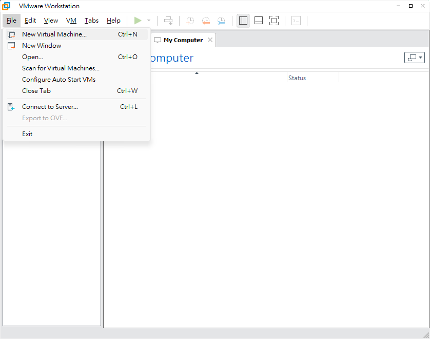

- **描述**: 開啟 VMware Workstation，點選功能表 **File**。
- **操作**: 選擇 **New Virtual Machine...**（快捷鍵 `Ctrl+N`）。
- **意義**: 啟動 New Virtual Machine Wizard，開始定義 Guest 的虛擬硬體與安裝來源。

### 步驟 2: 選擇組態類型

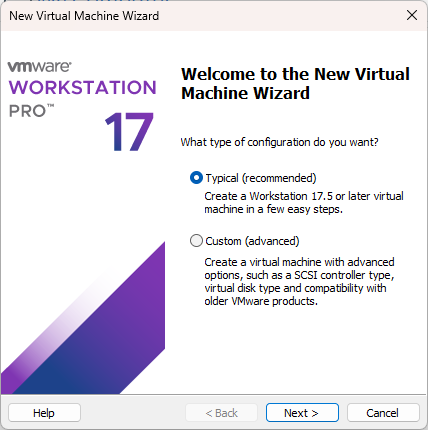

- **描述**: 精靈詢問組態類型。
- **操作**: 選取 **Typical (recommended)**，再按 **Next >**。
- **意義**: Typical 會套用適合新版 Workstation 的預設值，步驟較少，適合標準學習環境。若需精細控制 SCSI 控制器、舊版相容性等，才改用 **Custom (advanced)**。

### 步驟 3: 指定安裝媒體（ISO）

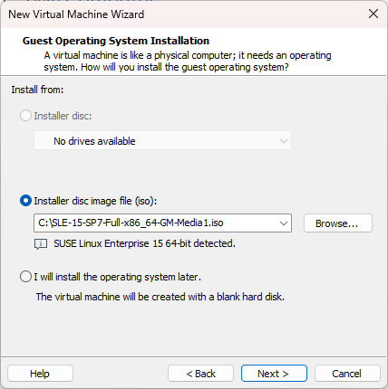

- **描述**: 畫面為 **Guest Operating System Installation**。
- **操作**:
  1. 選取 **Installer disc image file (iso)**
  2. 透過 **Browse...** 指向已下載的 ISO  
     範例：`C:\SLE-15-SP7-Full-x86_64-GM-Media1.iso`
  3. 確認出現 **SUSE Linux Enterprise 15 64-bit detected.**
  4. 按 **Next >**
- **意義**: 讓 VM 開機時直接讀取安裝光碟映像。VMware 自動偵測 OS 後，會建議較合適的虛擬硬體預設值。

### 步驟 4: 命名虛擬機與存放位置

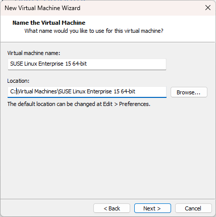

- **描述**: 畫面為 **Name the Virtual Machine**。
- **操作**:
  - **Virtual machine name**: 例如 `SUSE Linux Enterprise 15 64-bit`
  - **Location**: 例如 `C:\Virtual Machines\SUSE Linux Enterprise 15 64-bit`
  - 按 **Next >**
- **意義**: 名稱方便在 Library 辨識；Location 決定 `.vmx`、虛擬磁碟等檔案存放處。磁碟空間不足時，應改放到容量較大的磁碟機。

### 步驟 5: 指定虛擬磁碟容量

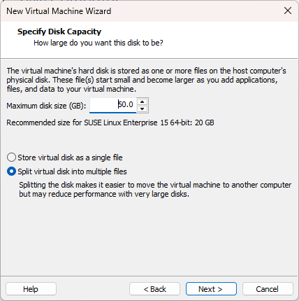

- **描述**: 畫面為 **Specify Disk Capacity**。
- **操作**:
  - **Maximum disk size (GB)**: 設為 `50.0`（官方建議約 20 GB，學習環境建議預留更多）
  - 選取 **Split virtual disk into multiple files**
  - 按 **Next >**
- **意義**:
  - 此處設定的是虛擬磁碟「上限」，實際占用會隨資料成長。
  - 分割成多檔較利於搬移（避開單一檔案過大限制）；對超大磁碟可能略影響效能。

### 步驟 6: 確認摘要並建立

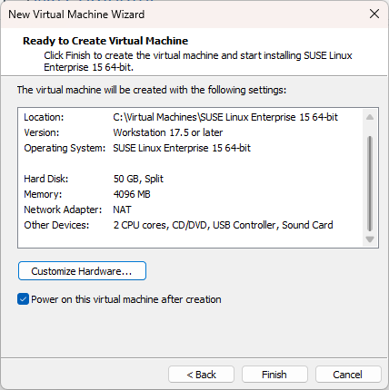

- **描述**: 畫面為 **Ready to Create Virtual Machine**，列出最終硬體摘要。
- **本範例摘要**:
  - Location: `C:\Virtual Machines\SUSE Linux Enterprise 15 64-bit`
  - Version: Workstation 17.5 or later
  - Operating System: SUSE Linux Enterprise 15 64-bit
  - Hard Disk: 50 GB, Split
  - Memory: 4096 MB
  - Network Adapter: NAT
  - Other devices: CPU 2 cores、CD/DVD、USB Controller、Sound Card
- **操作**:
  1. 需要時按 **Customize Hardware...** 微調 CPU / RAM / 網路
  2. 可勾選 **Power on this virtual machine after creation**
  3. 按 **Finish**
- **意義**: 這是建立 VM 前最後檢查點。NAT 適合先完成安裝與上網下載；確認無誤後才真正建立虛擬硬體。

### VMware 設定學習心得

- 先把 ISO、名稱、磁碟、記憶體、網卡一次設對，可大幅減少安裝中斷。
- NAT 對初學安裝最省事；若之後需要區網直連服務，再改 Bridge。
- Snapshot 建議在「安裝完成且可登入」後建立，作為可回復基線。

### 練習：VMware 設定

1. 說明為何建議把虛擬磁碟設得比官方最低需求更大。
2. 比較 **Store as a single file** 與 **Split into multiple files** 的取捨。
3. 若 Host 磁碟空間緊張，應優先調整哪些 VM 設定？

---

## 1-5. SLE 15 安裝

VM 開機並從 ISO 啟動後，進入 SLES 安裝精靈。以下逐步說明畫面、建議操作與意義。

### 步驟 1: Insert DVD / 開機選單

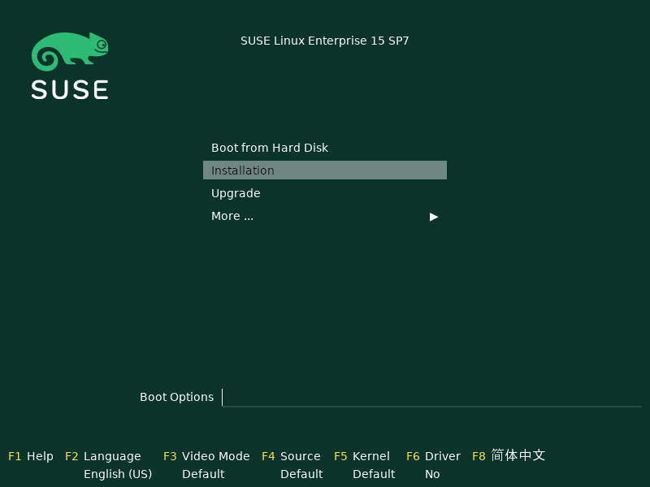

- **描述**: SLES 安裝媒體開機選單（深綠色背景）。目前反白選項為 **Installation**。
- **操作**: 選取 **Installation** 後按 Enter。  
  必要時可用功能鍵調整：
  - **F2 Language**: 安裝過程語言（範例為 English (US)）
  - **F3 Video Mode**
  - **F4 Source**
  - **F5 Kernel**
  - **F6 Driver**
- **意義**: 這是安裝起點。選 **Boot from Hard Disk** 會改從硬碟開機；選 **Upgrade** 則用於升級既有系統。

### 步驟 2: Language, Keyboard and Product Selection

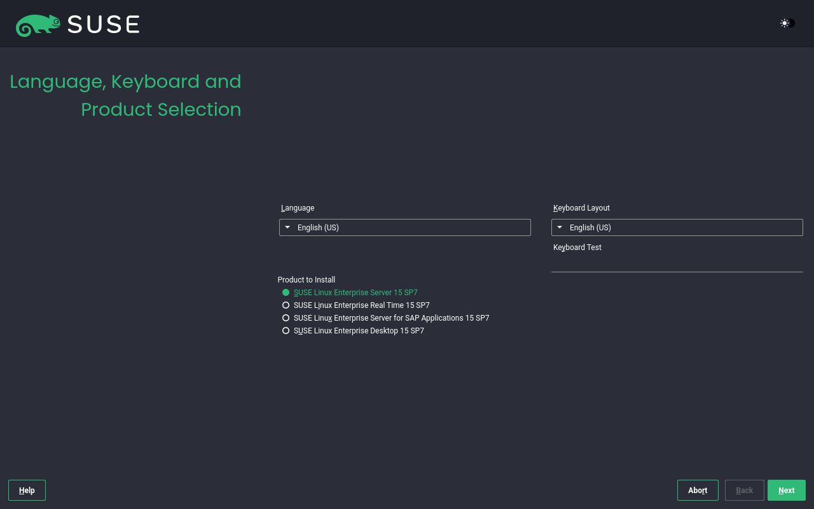

- **描述**: 設定語言、鍵盤，並選擇要安裝的產品。
- **操作**:
  - Language: **English (US)**（一般伺服器常見）
  - Keyboard Layout: **English (US)**
  - Product to Install: **SUSE Linux Enterprise Server 15 SP7**
  - 按 **Next**
- **可選產品差異**:
  - **SUSE Linux Enterprise Server 15 SP7**：標準企業伺服器（本筆記選用）
  - **SUSE Linux Enterprise Real Time 15 SP7**：低延遲／即時工作負載
  - **SUSE Linux Enterprise Server for SAP Applications 15 SP7**：SAP 場景優化
  - **SUSE Linux Enterprise Desktop 15 SP7**：桌面導向
- **意義**: 產品選擇決定後續可用模組、預設套件與支援定位；語言／鍵盤影響安裝介面與輸入正確性。

### 步驟 3: License Agreement

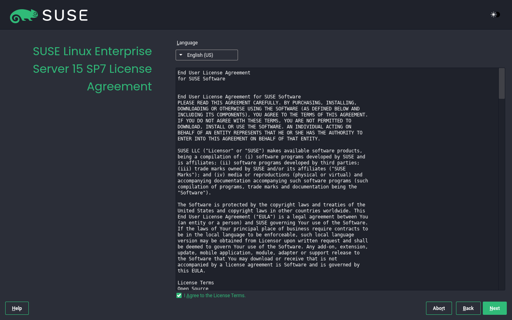

- **描述**: 顯示 End User License Agreement（EULA）。
- **操作**: 勾選 **I Agree to the License Terms.**，再按 **Next**。
- **意義**: 必須接受授權條款才能繼續。此步驟屬於法律與合規確認，不是可略過的技術選項。

### 步驟 4: Registration

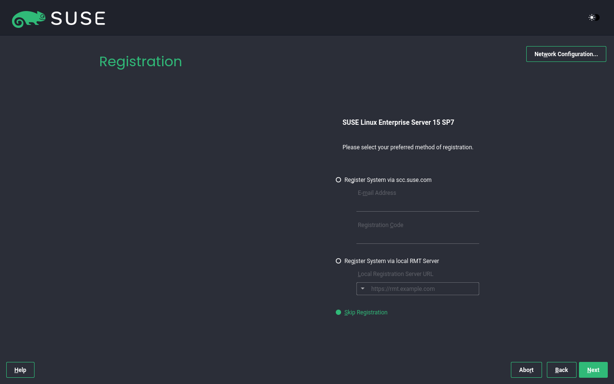

- **描述**: 系統註冊畫面，用於啟用更新、修補與支援通道。
- **選項**:
  - **Register System via scc.suse.com**：以 Email + Registration Code 向 SUSE Customer Center 註冊
  - **Register System via local RMT Server**：走內部 Repository Mirroring Tool
  - **Skip Registration**：稍後再註冊
- **操作（試用／練習）**: 選取 **Skip Registration**，再按 **Next**。  
  若之後要線上註冊，可先按 **Network Configuration...** 確認網路可用。
- **意義**: 正式環境通常應註冊以取得更新來源；練習機可先略過，但稍後仍建議完成註冊或設定內部 mirror。

### 步驟 5: Extension and Module Selection

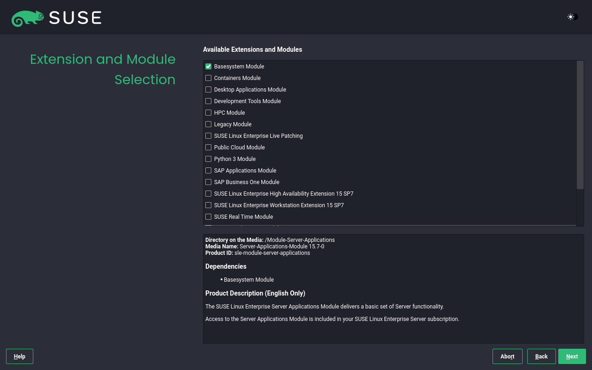

- **描述**: 選擇要啟用的 Extension / Module（模組化系統的核心畫面）。
- **操作**: 只勾選 **Basesystem Module**，再按 **Next**。
- **意義**:
  - SLES 採模組化，可依需求加入 Containers、Development Tools、Public Cloud、High Availability 等。
  - 初學與 Minimal 伺服器先保留 Basesystem，可降低安裝體積與攻擊面；之後再用註冊通道或媒體加裝。

### 步驟 6: Add-On Product

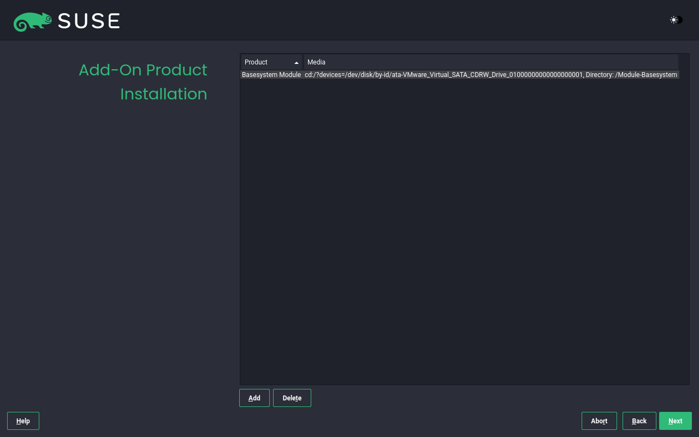

- **描述**: 顯示目前將安裝的附加產品列表。範例中僅有 **Basesystem Module**，來源為虛擬光碟路徑。
- **操作**: 若無額外 ISO／第三方 Add-on，不需按 **Add**，直接 **Next**。
- **意義**: 此步用來加入其他媒體上的擴充產品；沒有額外來源就維持預設即可。

### 步驟 7: System Role

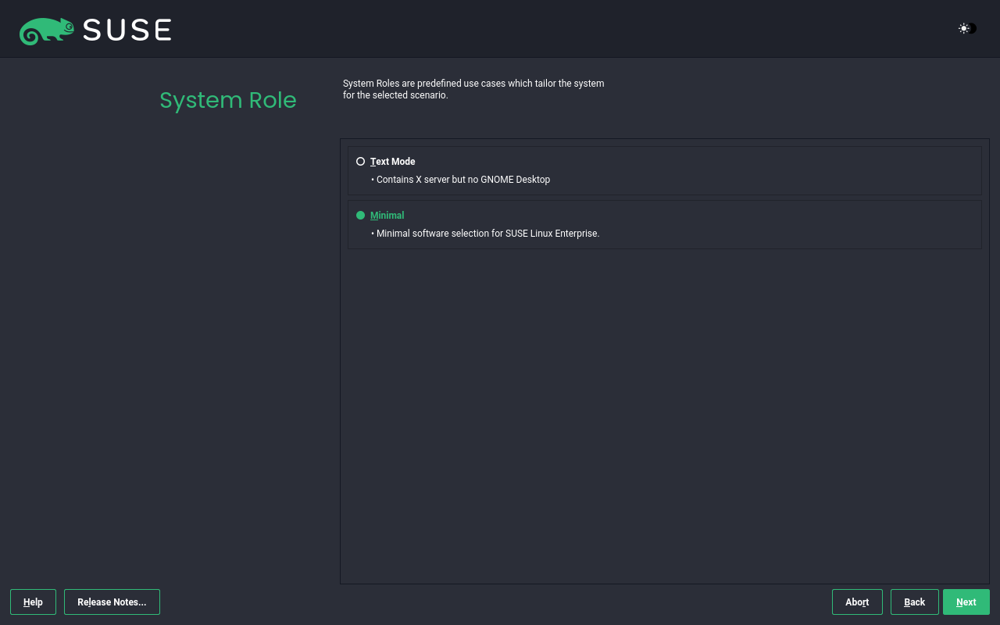

- **描述**: 依使用情境套用預先定義的軟體組合。
- **選項**:
  - **Text Mode**: 含 X server，但不含 GNOME Desktop
  - **Minimal**: 最小軟體選取（本筆記選用）
- **操作**: 選取 **Minimal**，再按 **Next**。
- **意義**: Minimal 適合伺服器學習與精簡部署，稍後可再依角色安裝必要套件，避免一次裝太多用不到的軟體。

### 步驟 8: Suggested Partitioning

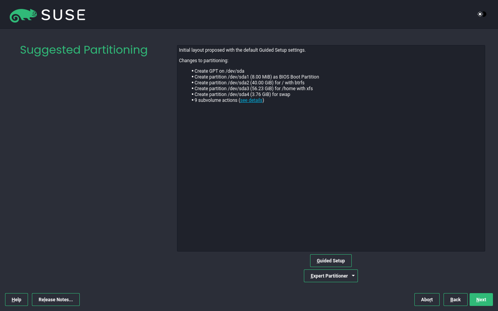

- **描述**: 依 Guided Setup 提出磁碟配置建議（針對 `/dev/sda`）。
- **本範例建議**:
  - Create GPT on `/dev/sda`
  - `/dev/sda1`（8.00 MiB）：BIOS Boot Partition
  - `/dev/sda2`（40.00 GiB）：`/`，檔案系統 **btrfs**
  - `/dev/sda3`（56.23 GiB）：`/home`，檔案系統 **xfs**
  - `/dev/sda4`（3.76 GiB）：**swap**
  - 另有 btrfs subvolume 相關動作（利於快照）
- **操作**: 初學可接受建議並按 **Next**；進階需求可進 **Guided Setup** 或 **Expert Partitioner**。
- **意義**:
  - GPT + BIOS Boot 對應特定開機情境。
  - 根目錄使用 btrfs，便於 snapshot／回復。
  - `/home` 分離可降低使用者資料與系統損壞互相牽連的風險。
  - swap 提供記憶體不足時的緩衝。

### 磁碟分割與檔案系統基礎

安裝時的 Suggested Partitioning 會用到開機分割、分割表型態與檔案系統選擇。以下整理常見概念，方便判讀安裝程式建議，以及日後使用 Expert Partitioner。

#### BIOS Boot Partition 與 EFI System Partition

開機方式不同，需要的「開機相關分割」也不同。

| 項目         | BIOS Boot Partition                                          | EFI System Partition（ESP）                         |
| ------------ | ------------------------------------------------------------ | --------------------------------------------------- |
| 典型場景     | **BIOS（Legacy）+ GPT**                                      | **UEFI + GPT**                                      |
| 用途         | 存放 GRUB 等 bootloader 的部份程式碼（非一般可掛載系統目錄） | 存放 EFI bootloader、`*.efi`、開機管理相關檔案      |
| 常見大小     | 約 1–8 MiB（本安裝範例為 8.00 MiB）                          | 常見 100–512 MiB 或更大                             |
| 檔案系統     | 通常無一般 OS 檔案系統（bios_grub 類用途）                   | 多為 **FAT32**                                      |
| 掛載點       | 通常不掛成 `/` 或 `/boot`                                    | 常見掛載於 `/boot/efi`                              |
| 與本範例關係 | 畫面中的 `/dev/sda1` BIOS Boot Partition 即屬此類            | 若 VM／主機改為 UEFI 開機，安裝程式通常會改建議 ESP |

- **意義**:
  - 使用 **MBR + BIOS** 時，bootloader 常寫入 MBR 空隙，不一定需要 BIOS Boot Partition。
  - 使用 **GPT + BIOS** 時，MBR 相容區不足以放完整 GRUB core，因此需要 BIOS Boot Partition。
  - 使用 **UEFI** 時，韌體從 ESP 載入 EFI 應用，應建立 EFI System Partition，而不是 BIOS Boot Partition。
  - 開機失敗時，先確認「韌體模式（BIOS／UEFI）」與「實際建立的開機分割」是否一致。

#### Primary、Extended、Logical Partition（MBR 分割觀念）

傳統 **MBR（Master Boot Record）** 分割表有主／延伸／邏輯三種角色：

| 類型     | 英文                   | 說明                                                                                        |
| -------- | ---------------------- | ------------------------------------------------------------------------------------------- |
| 主要分割 | **Primary Partition**  | 可直接開機或放資料；一顆碟在 MBR 下最多 **4** 個 primary                                    |
| 延伸分割 | **Extended Partition** | 不算一般資料分割，而是「容器」，用來突破 4 個分割的限制；一顆碟通常只能有 **1** 個 extended |
| 邏輯分割 | **Logical Partition**  | 建在 extended 之內，可再切出多個邏輯碟（如 `/dev/sda5` 起跳的常見編號習慣）                 |

- **結構關係**: Primary 與 Extended 佔用 MBR 的 4 個槽位；Logical 只能存在於 Extended 內。
- **範例思路**: 3 個 Primary + 1 個 Extended，再於 Extended 內建立多個 Logical（`/`、`/home`、swap 等）。
- **與 GPT 的差異**: **GPT（GUID Partition Table）** 不再使用 Primary／Extended／Logical 這套限制，可直接建立多個分割，並以 GPT 項目類型區分用途（含 BIOS Boot、EFI System 等）。
- **本安裝範例**: 使用 **GPT**，因此看到的是 GPT 分割用途，而非 MBR 的 Primary／Extended／Logical 命名。

#### LVM（Logical Volume Manager）

**LVM** 把實體裝置抽象成可彈性調整的邏輯儲存層，常見三層：

| 層級 | 名稱            | 意義                                 |
| ---- | --------------- | ------------------------------------ |
| PV   | Physical Volume | 實體碟或分割，納入 LVM 管理          |
| VG   | Volume Group    | 由一個或多個 PV 組成的容量池         |
| LV   | Logical Volume  | 從 VG 切出的邏輯磁碟，再格式化並掛載 |

- **優點**:
  - 可線上／較彈性地擴充（或依規劃縮減）檔案系統空間
  - 多顆碟可組成同一 VG，統一分配
  - 可搭配 snapshot（視設定與需求）做備份或回復輔助
- **代價**: 多一層管理複雜度；救援與人手修復時需熟悉 `pv`／`vg`／`lv` 工具鏈
- **安裝意義**: Expert Partitioner 可選 LVM；適合預計會成長的資料區（如 `/var`、資料碟）。初學 Minimal 可先用傳統分割，掌握概念後再導入。

#### RAID（Redundant Array of Independent Disks）

**RAID** 把多顆磁碟組成陣列，目標通常是效能、冗餘，或兩者兼顧。

| 常見層級 | 概念              | 意義                                      |
| -------- | ----------------- | ----------------------------------------- |
| RAID 0   | 分條（striping）  | 效能佳，無冗餘；一顆壞即資料風險高        |
| RAID 1   | 鏡像（mirroring） | 兩顆互備，可承受單碟故障                  |
| RAID 5   | 分條 + 同位       | 需至少 3 顆；可承受單碟故障，重建期有風險 |
| RAID 6   | 雙同位            | 可承受兩顆故障，代價是更多校驗空間        |
| RAID 10  | 鏡像 + 分條       | 兼顧效能與冗餘，碟數與成本較高            |

- **軟體 RAID（mdadm 等）** 與 **硬體／偽硬體 RAID** 差異在管理位置與救援方式。
- **注意**: RAID 不是備份；無法防誤刪、勒索或邏輯損壞，仍需獨立備份策略。
- **安裝意義**: 企業機常在 BIOS／RAID 卡或安裝程式中先組成陣列，再在其上做分割／LVM。

#### Linux 常見檔案系統：ext2 / ext3 / ext4 / XFS / swap

| 檔案系統                | 特色                                       | 典型用途                                                           |
| ----------------------- | ------------------------------------------ | ------------------------------------------------------------------ |
| **ext2**                | 早期 ext，無 journal                       | 小型／特殊分割；現已少用於系統碟                                   |
| **ext3**                | 在 ext2 基礎上加入 **journaling**          | 提升異常斷電後的一致性回復能力                                     |
| **ext4**                | ext 系列主流後繼；支援更大容量、extent 等  | 通用根目錄或資料碟，相容性佳                                       |
| **XFS**                 | 高效能、擅長大檔與平行 I/O；journaling     | 資料碟、`/home`、日誌／媒體等高吞吐場景（本範例 `/home` 使用 xfs） |
| **swap**                | 不是一般「存放檔案」的 FS，而是交換空間    | 記憶體不足時換出頁面；亦可輔助 hibernate（視設定）                 |
| **btrfs**（本範例 `/`） | 寫入時複製、subvolume、snapshot 等進階能力 | SLES 預設根檔系統常見選擇，利於快照回復                            |

- **journaling 意義**: 先記錄中繼資料變更意向，降低崩潰後長時間 fsck 與不一致風險。
- **swap 大小**: 視 RAM、是否休眠、工作負載而定；雲端／大記憶體主機有時可較小，但仍建議保留基本緩衝。
- **選擇原則**: 根目錄重視可維護與快照（SLES 常用 btrfs）；大容量資料區常評估 XFS／ext4；互換空間用 swap。

#### Windows／可攜常見檔案系統：FAT / NTFS

| 檔案系統                         | 特色                                         | 在 Linux 安裝中的意義                                                                            |
| -------------------------------- | -------------------------------------------- | ------------------------------------------------------------------------------------------------ |
| **FAT**（含 FAT16／FAT32／vfat） | 相容性極高、結構簡單；單檔大小與權限能力有限 | **ESP（EFI System Partition）** 通常使用 FAT32；USB 隨身碟也常見                                 |
| **NTFS**                         | Windows 主流；支援較大檔案與較完整中繼資料   | Linux 可讀寫（視驅動／工具），但系統根目錄不會用 NTFS；雙系統資料交換或掛載 Windows 資料碟時常見 |

- **意義**: 看到 FAT 不一定代表「Windows 資料碟」，在 UEFI 機器上更可能是開機用的 ESP。
- **權限模型**: FAT／NTFS 與 Linux POSIX 權限模型不同，不當共用系統碟會讓權限與屬主變得難管。

#### 對照本安裝範例的判讀

| 本範例項目                      | 對應概念                                                     |
| ------------------------------- | ------------------------------------------------------------ |
| Create GPT on `/dev/sda`        | 使用 GPT，不以 MBR Primary／Extended／Logical 模型為主       |
| `/dev/sda1` BIOS Boot Partition | BIOS + GPT 所需的 bootloader 空間                            |
| `/` + btrfs                     | 系統區，強調 snapshot／回復                                  |
| `/home` + xfs                   | 使用者資料區，偏重吞吐與大檔                                 |
| swap                            | 記憶體換頁空間                                               |
| （若改 UEFI）                   | 應出現 EFI System Partition（FAT），而非 BIOS Boot Partition |

### 練習：磁碟與檔案系統

1. 比較 BIOS Boot Partition 與 EFI System Partition 的適用開機模式與常見檔案系統。
2. 用圖或條列說明 MBR 下 Primary、Extended、Logical 的數量限制與包含關係。
3. 說明 LVM 的 PV／VG／LV 三層各自解決什麼問題。
4. 解釋 RAID 1 與 RAID 0 在「效能」與「冗餘」上的差異，並說明為何 RAID 不能取代備份。
5. 為 `/`、`/home`、ESP、交換空間各選一種合適的檔案系統／分割類型，並寫出理由。

### 步驟 9: Clock and Time Zone

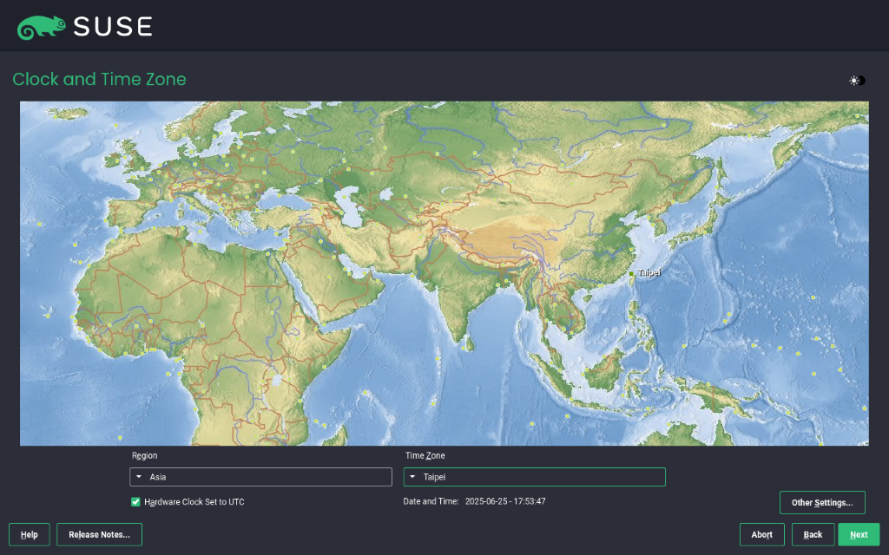

- **描述**: 以世界地圖與下拉選單設定時區。
- **操作**:
  - Region: **Asia**
  - Time Zone: **Taipei**
  - 建議勾選 **Hardware Clock Set To UTC**
  - 必要時按 **Other Settings...** 調整 NTP／手動時間
  - 按 **Next**
- **意義**: 正確時區影響日誌時間、憑證有效期判斷、排程（cron）與叢集同步。硬體時鐘使用 UTC 是 Linux 常見最佳實務。

### 步驟 10: Local User

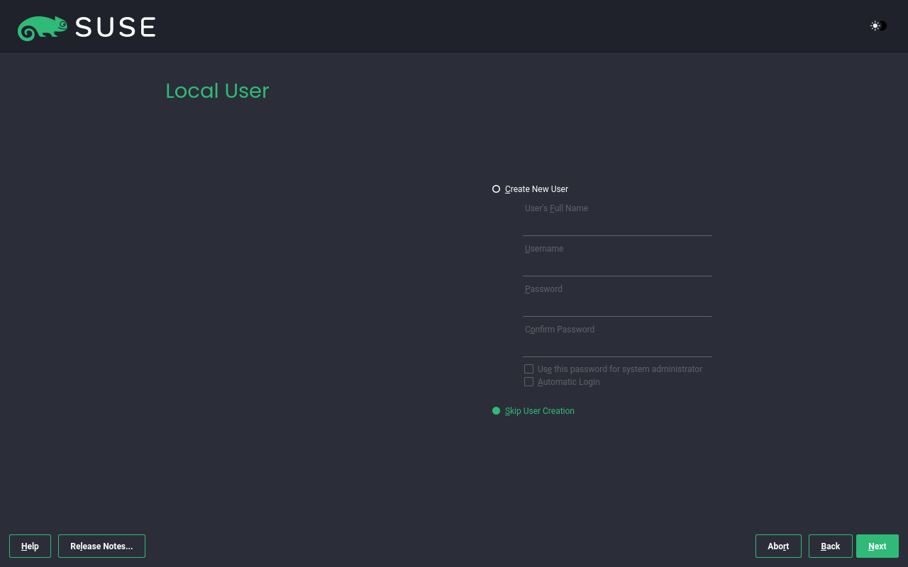

- **描述**: 建立本機一般使用者，或略過稍後再建。
- **操作（本範例）**: 選取 **Skip User Creation**，再按 **Next**。  
  若要現建帳號，改選 **Create New User** 並填寫 Full Name、Username、Password。
- **意義**: 伺服器可用 root 完成初期設定後再建一般使用者；正式環境仍建議日常操作使用非 root 帳號，並搭配 `sudo`。

### 步驟 11: Authentication for the system administrator “root”

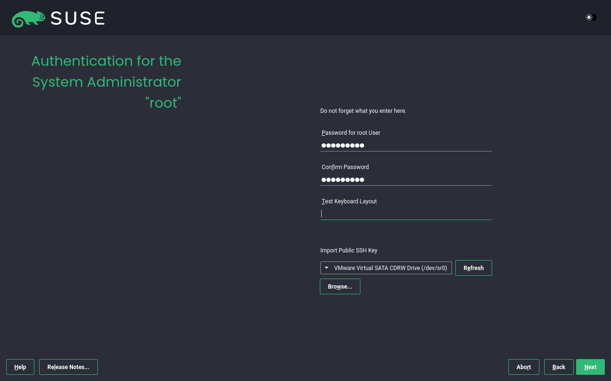

- **描述**: 設定系統管理員 `root` 密碼；畫面提示 **Do not forget what you enter here.**
- **操作**:
  1. 輸入並確認 **Password for root User**
  2. 使用 **Test Keyboard Layout** 驗證特殊字元是否正確
  3. （可選）透過 **Import Public SSH Key** 匯入公鑰
  4. 按 **Next**
- **意義**: `root` 是最高權限帳號，密碼遺失會造成管理困難。鍵盤配置錯誤常導致「以為密碼正確卻無法登入」。

### 步驟 12: Installation Settings（安裝前總確認）

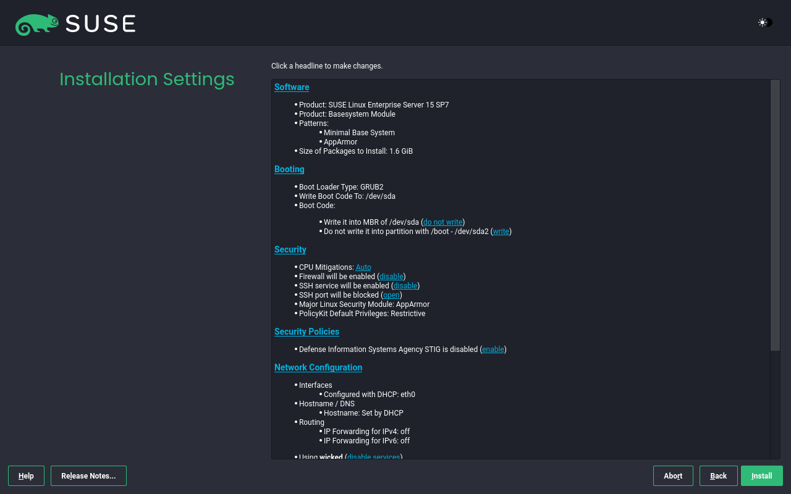

- **描述**: 安裝前總覽，可點標題修改對應設定。
- **本範例重點**:
  - **Software**: SLES 15 SP7 + Basesystem Module；Patterns 為 Minimal Base System，含 AppArmor；約 1.6 GiB
  - **Booting**: Boot Loader = **GRUB2**，寫入 `/dev/sda`
  - **Security**: Firewall enabled；SSH service enabled；SSH port blocked；Major LSM = AppArmor
  - **Network Configuration**: `eth0` 使用 DHCP；網路服務為 `wicked`
- **操作**: 確認無誤後按 **Install** 開始寫入磁碟。
- **意義**: 這是最後反悔點。尤其要注意開機載入器位置、防火牆與 SSH 埠是否符合後續遠端管理需求。

### 步驟 13: Boot（GRUB2）

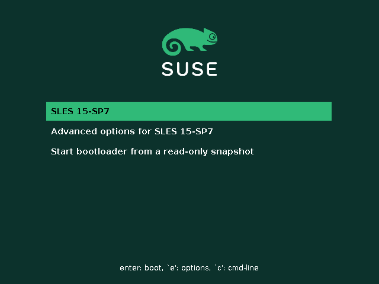

- **描述**: 安裝完成重開機後，出現 GRUB2 選單。
- **操作**: 選取 **SLES 15-SP7** 後按 Enter。  
  其他項目：
  - **Advanced options for SLES 15-SP7**
  - **Start bootloader from a read-only snapshot**（btrfs 快照回復相關）
- **意義**: GRUB2 負責載入核心與初始環境。快照開機選項是 SLES / btrfs 生態的重要回復能力。

### 步驟 14: Begin（登入畫面）

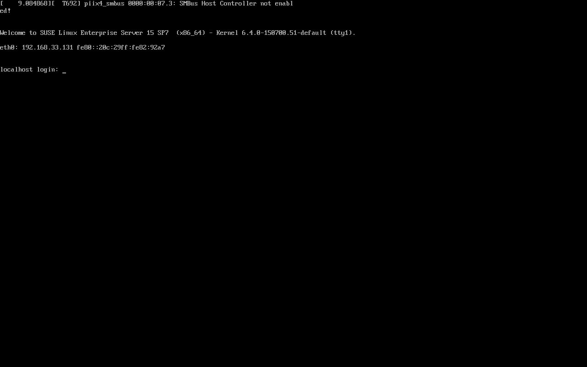

- **描述**: 系統成功開機至文字登入畫面。
- **可見資訊範例**:
  - Welcome to SUSE Linux Enterprise Server 15 SP7 (x86_64)
  - Kernel 6.4.0-150700.51-default
  - `eth0`: IPv4 `192.168.33.131`（DHCP 取得，實際值依環境而異）
  - 提示字元：`localhost login:`
- **操作**: 以 `root` 與先前設定的密碼登入，開始後續設定。
- **意義**: 能看到登入提示與 IP，代表安裝、開機、基礎網路大致成功。畫面上若出現虛擬化相關 kernel 訊息（例如 SMBus warning），在 VM 環境通常可先觀察，不一定是安裝失敗。

---

## 安裝流程學習心得

- 安裝精靈的本質是「把系統角色、磁碟、帳號、安全與網路一次定錨」。
- Minimal + Basesystem 是很好的學習起點：先求可開機、可登入、可連網，再按需求長功能。
- Registration 可暫時略過，但真正要更新與長期維護時仍需處理。
- Installation Settings 務必逐段檢查，特別是 Boot Loader、Firewall、SSH。
- 完成後立刻驗證：能否登入、是否有 IP、時間是否正確、磁碟掛載是否符合預期。
- 磁碟規劃先對齊開機模式（BIOS／UEFI），再選分割表（MBR／GPT）、是否 LVM／RAID，最後才選檔案系統；開機分割選錯往往比容量選錯更致命。

---

## 步驟總結

建議依下列順序完成第一章實作：

1. **確認硬體資源**（CPU / RAM / Disk）符合目標角色
2. **下載正確的 SLES 15 SP7 ISO**
3. **在 VMware 建立 VM**（Typical → 掛 ISO → 命名 → 磁碟 50GB → 確認 NAT / 4GB RAM）
4. **開機進入 Installation**
5. **選 English + SLES 15 SP7**，同意 License
6. **練習環境可 Skip Registration**
7. **只選 Basesystem Module**，System Role 選 **Minimal**
8. **接受（或審視）分割區建議**，並確認開機分割（BIOS Boot 或 ESP）、檔案系統（btrfs／xfs／swap 等）是否符合開機模式與用途
9. **設定時區**（如 Asia/Taipei）
10. **設定 root 密碼**（可先略過本機一般使用者）
11. **在 Installation Settings 最終確認後按 Install**
12. **重開機後於 GRUB 選 SLES 15-SP7**，登入並確認網路

---

## 總結

本章完成從「認識 SUSE / SLES」到「在 VMware 實際安裝 SLES 15 SP7」的完整路徑。關鍵不是記住每個按鈕位置，而是理解每個步驟在決定什麼：產品與模組決定系統能力邊界，分割區與檔案系統決定開機方式、資料配置與回復策略，帳號與安全設定決定管理方式，網路設定決定後續是否裝得了更新與服務。理解 BIOS Boot／ESP、MBR 的 Primary／Extended／Logical、LVM／RAID，以及 ext 系列、XFS、swap、FAT／NTFS 的定位後，較能判斷安裝程式建議是否合理。安裝成功並可登入後，即可進入後續章節的系統管理與指令學習。

### 綜合練習

1. 不看筆記，默寫從 VMware 建機到 SLES 登入的主要步驟。
2. 說明為何學習環境常選 Minimal，而正式應用伺服器可能需要額外 Module。
3. 若安裝後無法以 SSH 連線，應優先檢查 Installation Settings 中哪些項目？
4. 比較 Skip Registration 的短期便利與長期維運風險。
