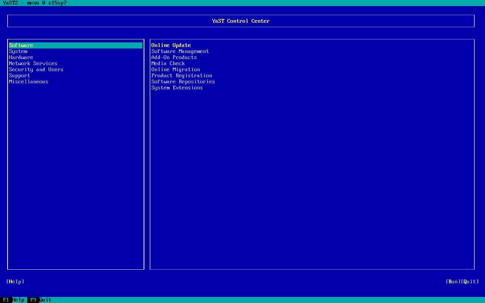

# ch2. SUSE Linux Enterprise Server 15 - 基礎管理

安裝完成後，需先熟悉系統電源操作、檔案導覽、權限、YaST、網路與套件、帳號與提權，以及常用文字工具。本章以 SLES 15 實務指令為主，說明每個指令／設定檔的意義，並附練習與總結。

---

## 2-1. Basic Command（基礎指令）

### 系統關機與重啟

```bash
sle15:~ # reboot
sle15:~ # shutdown -h 0
sle15:~ # uptime
```

| 指令 | 說明 | 意義 |
| --- | --- | --- |
| `reboot` | 重新啟動系統 | 套用核心、驅動或需重開才生效的設定後使用 |
| `shutdown` | 關機、重啟或延遲關機 | 可通知服務優雅結束；`-h 0` 表示立即 halt |
| `uptime` | 顯示開機後運行時間與負載 | 快速確認系統是否剛重開、負載是否異常 |

- **`shutdown` 常用型態**:
  - `shutdown -h now` / `shutdown -h 0`：立即關機
  - `shutdown -r now`：立即重啟
  - `shutdown -c`：取消已排程關機
- **意義**: 伺服器環境應優先用可排程、可廣播訊息的關機方式，避免直接斷電造成檔案系統不一致。

### 檔案與目錄管理

```bash
sle15:~ # pwd
sle15:~ # cd $HOME
sle15:~ # cd ~
sle15:~ # ls -la
sle15:~ # mkdir abc
sle15:~ # cd abc
sle15:~ # cd ..
```

| 指令 | 說明 | 意義 |
| --- | --- | --- |
| `pwd` | 顯示目前工作目錄（Print Working Directory） | 確認「人在哪裡」，避免對錯路徑操作 |
| `ls` | 列出目錄內容 | `-l` 詳細、`-a` 含隱藏檔（`.` 開頭） |
| `cd` | 切換目錄 | `~` / `$HOME` 回家目錄；`..` 上一層 |
| `mkdir` | 建立目錄 | 可搭配 `-p` 建立多層路徑 |
| `rmdir` | 刪除空目錄 | 目錄非空會失敗，較安全 |
| `cp` | 複製檔案／目錄 | 目錄需 `-r`；保留屬性常用 `-a` |
| `mv` | 移動或重新命名 | 同檔系統多為 rename，跨檔系統才真正搬移 |
| `rm` | 刪除檔案／目錄 | 目錄用 `-r`；危險操作，刪除後不易回復 |

#### 建議練習流程（步驟與意義）

1. **`pwd`**：確認當前路徑  
2. **`cd ~`**：回到家目錄，建立固定起點  
3. **`mkdir abc && cd abc`**：建立練習目錄並進入  
4. **`ls -la`**：觀察 `.`、`..` 與權限欄位  
5. **`cd ..`**：回到上一層，理解相對路徑

### 學習心得：基礎指令

- Linux 操作幾乎都圍繞「路徑」與「權限」；先養成 `pwd` / `ls -la` 的習慣可減少誤刪。
- `~` 與 `$HOME` 通常等價，但腳本中寫 `$HOME` 較明確。
- `rm -rf` 威力大，正式環境應先確認路徑，必要時先 `ls` 再刪。

### 練習：基礎指令

1. 用相對路徑建立 `~/lab/ch2`，再以 `pwd` 驗證。
2. 說明 `cd ..` 與 `cd /` 的差異。
3. 比較 `rmdir dir` 與 `rm -r dir` 的適用時機。

---

## 2-2. 檔案與權限（File Permissions）

檔案權限控制「誰可以讀取、修改或執行」檔案／目錄，是 Linux 安全的第一層（DAC）。

### 相關指令

| 指令 | 說明 |
| --- | --- |
| `ls -l` / `ls -la` | 顯示權限、擁有者、大小、時間 |
| `chmod` | 修改權限 |
| `chown` / `chgrp` | 修改擁有者／群組 |
| `stat` | 顯示 inode、權限、時間戳等細節 |

### 使用者身份（User types）

| 類別 | 說明 |
| --- | --- |
| `u` | 擁有者（User / Owner） |
| `g` | 群組（Group） |
| `o` | 其他人（Others） |
| `a` | 所有身份（All = u+g+o） |

### 權限種類（Permissions）

| 符號 | 名稱 | 對檔案 | 對目錄 |
| --- | --- | --- | --- |
| `r` | read | 讀取內容 | 列出內容（`ls`） |
| `w` | write | 修改內容 | 建立／刪除／改名 |
| `x` | execute | 執行程式／腳本 | 進入目錄（`cd`） |

### 權限顯示方式

```bash
sle15:~ # ls -l
-rwxr-xr-- 1 kai users 1234 Jul  7 10:00 myfile.sh
```

| 欄位 | 說明 |
| --- | --- |
| `-` | 類型：`-` 一般檔、`d` 目錄、`l` 符號連結 |
| `rwx` | owner 權限 |
| `r-x` | group 權限 |
| `r--` | others 權限 |

### 修改權限：Symbolic / Octal

```bash
# Symbolic mode
sle15:~ # chmod u+x myfile.sh     # 給 user 增加執行權限
sle15:~ # chmod g-w myfile.sh     # 移除 group 寫入
sle15:~ # chmod o=r myfile.sh     # other 只讀
sle15:~ # chmod a+x myfile.sh     # 所有人可執行

# Octal mode
sle15:~ # chmod 755 myfile.sh     # u=rwx, g=rx, o=rx
sle15:~ # chmod 644 myfile.txt    # u=rw, g=r, o=r
```

| 權限 | 數字 |
| --- | --- |
| `r` | 4 |
| `w` | 2 |
| `x` | 1 |

- **換算意義**: `7=4+2+1`（rwx）、`5=4+1`（r-x）、`4`（r--）。
- **常見組合**:
  - `755`：腳本／可執行檔常見
  - `644`：一般文字檔常見
  - `600`：私密檔（如金鑰、shadow 類敏感資料的概念）

### 擁有者與群組

```bash
sle15:~ # chown kai myfile.sh
sle15:~ # chown kai:devs myfile.sh
sle15:~ # chgrp devs myfile.sh
```

- **意義**: 權限檢查順序是 owner → group → others；擁有者改錯會導致服務讀不到設定檔。

### 目錄權限提醒

| 權限 | 功能 |
| --- | --- |
| `r` | 可 `ls` 列出 |
| `x` | 可 `cd` 進入 |
| `w` | 可在目錄內建立／刪除／改名 |
| `rx` | 可列出並進入 |

- 只有 `r` 沒有 `x`：無法 `cd` 進入該目錄。
- 目錄的 `w` 影響的是「目錄條目」，即使檔案本身不可寫，仍可能被有目錄寫入權的人刪除（除非 sticky bit）。

### 特殊權限（進階）

| 權限位 | 名稱 | 用途 |
| --- | --- | --- |
| `s`（user） | setuid | 程式以檔案擁有者身分執行 |
| `s`（group） | setgid | 程式／目錄以群組身分運作；目錄下新建檔常繼承群組 |
| `t` | sticky | 常見於 `/tmp`：僅擁有者（或 root）可刪自己的檔 |

```bash
sle15:~ # chmod u+s myprog
sle15:~ # chmod g+s mydir
sle15:~ # chmod +t /tmp
```

### 學習心得：權限

- 檔案的 `x` 與目錄的 `x` 意義不同，這是初學最常見混淆點。
- 先讀懂 `ls -l`，再學 `chmod`／`chown`，排查「Permission denied」會快很多。
- 特殊權限強大但危險，生產環境變更前應先理解影響範圍。

### 練習：權限

1. 建立檔案並分別設成 `644`、`600`、`755`，用 `ls -l` 對照。
2. 建立目錄只給 `r--`，觀察 `ls` 與 `cd` 行為差異。
3. 解釋為何 `/tmp` 需要 sticky bit。

---

## 2-3. 文字處理入門指令

| 指令 | 說明 | 典型用途 |
| --- | --- | --- |
| `cat` | 顯示／串接檔案 | 看短檔、合併輸出 |
| `less` | 可上下捲動的分頁檢視 | 讀長檔、日誌 |
| `grep` | 依關鍵字／正規表示式搜尋 | 從日誌找錯誤 |
| `head` | 顯示前幾行 | 快速預覽 |
| `tail` | 顯示後幾行 | 看最新日誌；`-f` 追蹤 |
| `man` | 查詢指令說明 | 正式文件來源 |

- 更完整的文字工具說明見本章 **2-10. Text**。

### 練習：文字入門

1. 用 `man ls` 找出 `-a` 與 `-A` 差異。
2. 對任一設定檔執行 `head -n 20` 與 `tail -n 20`。

---

## 2-4. YaST（Yet another Setup Tool）

YaST 是 SUSE／SLES 的系統管理中樞，可用文字介面（TUI）或圖形介面管理軟體、網路、防火牆、使用者與磁碟等。

### YaST Control Center 畫面



- **描述**: 文字模式 YaST2 主選單（標題示例：`YaST2 - menu @ s15sp7`）。左側為分類，右側為該分類模組。
- **左側分類**: Software、System、Hardware、Network Services、Security and Users、Support、Miscellaneous
- **右側（Software 範例）**: Online Update、Software Management、Add-On Products、Media Check、Online Migration、Product Registration、Software Repositories、System Extensions
- **操作**:
  - 方向鍵選取分類／模組
  - **[Run]** 進入模組；**[Quit]** / `F9` 離開；`F1` 說明
- **意義**: 不熟指令時，可用 YaST 完成等價設定；熟悉後再對照底層設定檔與 CLI。

### 常用 YaST 指令

```bash
# 列出模組 / 查說明
sle15:~ # yast -l
sle15:~ # yast <MODULE> help

# 網路與防火牆
sle15:~ # yast lan list
sle15:~ # yast lan add name=eth0 ethdevice=eth0 bootproto=dhcp
sle15:~ # yast lan delete id=0
sle15:~ # yast lan edit id=0
sle15:~ # yast lan
sle15:~ # yast firewall

# 軟體庫與套件
sle15:~ # yast repositories
sle15:~ # yast sw_single

# 使用者
sle15:~ # yast users

# 系統
sle15:~ # yast host
sle15:~ # yast partitioner
```

| 模組 | 意義 |
| --- | --- |
| `yast lan` | 設定網卡、DHCP／靜態 IP |
| `yast firewall` | 管理防火牆區域與服務 |
| `yast repositories` | 管理軟體庫來源 |
| `yast sw_single` | 單套件安裝／移除介面 |
| `yast users` | 使用者與群組 |
| `yast host` | 主機名稱／hosts 相關 |
| `yast partitioner` | 磁碟分割（注意拼字為 partitioner） |

### 學習心得：YaST

- YaST 適合「先做對，再學底層」；最終仍應理解它改了哪些設定檔。
- Minimal 安裝可能缺少部分 YaST 模組，需先用 `zypper` 安裝對應 pattern（見後文）。

### 練習：YaST

1. 執行 `yast -l`，找出與網路、使用者、軟體相關的模組名稱。
2. 用 `yast lan list` 觀察目前介面，再對照 `wicked show`。

---

## 2-5. Setting（系統設定）

### 2-5-1. Network

#### 設定主機名稱

```bash
sle15:~ # hostnamectl hostname sle15
```

- **意義**: 主機名稱影響提示字元、日誌辨識、憑證與部分服務設定；應盡早固定。

#### 編輯介面設定檔

路徑慣例：`/etc/sysconfig/network/ifcfg-<interface>`

**靜態 IP 範例**（`/etc/sysconfig/network/ifcfg-eth0`）:

```ini
BOOTPROTO='static'
STARTMODE='auto'
IPADDR='192.168.1.100/24'
GATEWAY='192.168.1.1'
NAME='eth0'
```

**DHCP 範例**:

```ini
BOOTPROTO='dhcp'
STARTMODE='auto'
```

| 參數 | 意義 |
| --- | --- |
| `BOOTPROTO` | `static` 或 `dhcp` |
| `STARTMODE=auto` | 開機自動啟用介面 |
| `IPADDR` | 位址＋CIDR（含遮罩資訊） |
| `GATEWAY` | 預設閘道 |

#### 套用與檢查（wicked）

SLES 15 常見以 **wicked** 管理網路。

```bash
sle15:~ # wicked ifreload eth0
sle15:~ # wicked ifdown eth0
sle15:~ # wicked ifup eth0
sle15:~ # wicked show eth0
```

| 指令 | 意義 |
| --- | --- |
| `ifreload` | 依設定檔重新載入 |
| `ifdown` / `ifup` | 關閉／啟用介面 |
| `show` | 檢視目前狀態、位址 |

#### 網路設定步驟總結

1. 決定 DHCP 或 Static  
2. 編輯 `ifcfg-<iface>`  
3. `wicked ifreload` 或 `ifdown` + `ifup`  
4. 用 `wicked show`、`ip a`、`ping`、DNS 解析驗證

### 2-5-2. Firewall

```bash
localhost:~ # firewall-cmd --permanent --add-service ssh
localhost:~ # firewall-cmd --reload
```

- **`--permanent`**: 寫入永久設定  
- **`--reload`**: 讓永久規則生效  
- **意義**: 安裝時若 SSH port 被擋，遠端管理前必須放行 `ssh` 服務（或對應 port）。

### 2-5-3. Repository 與 Package

#### zypper（SUSE 主要套件工具）

```bash
# 從本地媒體加入 Basesystem 模組庫
sle15:~ # zypper ar file:///mnt/Module-Basesystem Module-Basesystem

# 查看 pattern
sle15:~ # zypper patterns

# 安裝 YaST 相關 pattern
sle15:~ # zypper in -t pattern yast2_basis yast2_server

# 一次加入 /mnt 下所有 Module-* 目錄為 repo
sle15:~ # ls -d /mnt/Module-* | xargs -i basename {} | xargs -i zypper ar file:///mnt/{} {}
```

| 指令／參數 | 意義 |
| --- | --- |
| `zypper ar` | add repository |
| `zypper patterns` | 列出軟體模式（一組套件） |
| `zypper in -t pattern ...` | 依 pattern 安裝 |

- **學習意義**: Minimal 安裝後若缺 YaST 模組，常需先掛載安裝媒體並加入 Module repo，再安裝 `yast2_basis` 等。

#### SUSEConnect（註冊與擴充）

```bash
sle15:~ # SUSEConnect --status
sle15:~ # SUSEConnect --regcode <REG_CODE> --email <email>
sle15:~ # SUSEConnect --cleanup
sle15:~ # SUSEConnect --product PackageHub/15.7/x86_64
sle15:~ # SUSEConnect --deregister --product PackageHub/15.5/x86_64
sle15:~ # SUSEConnect --list-extensions
```

| 用途 | 說明 |
| --- | --- |
| 註冊系統 | 取得官方更新通道 |
| Package Hub | 社群／額外套件來源，見 [SUSE Package Hub](https://packagehub.suse.com/) |
| Extensions | 列出可啟用擴充 |

#### rpm（底層套件格式與查詢）

**RPM**（RPM Package Manager）是 RHEL／SLES 等發行版的套件格式與底層工具。日常安裝建議優先 `zypper`（會處理相依）；`rpm` 擅長查詢與驗證。

**安裝**

```bash
sle15:~ # rpm -ivh package-1.0-1.x86_64.rpm
# -i install / -v verbose / -h hash 進度
# 注意：不會自動解決相依；缺依賴會失敗
```

**升級**

```bash
sle15:~ # rpm -Uvh new-version-package-2.0-1.x86_64.rpm
# -U：已安裝則升級；未安裝則安裝
```

**移除**

```bash
sle15:~ # rpm -e package
# 使用套件名稱，不是檔名
# 若被依賴，預設拒絕；--nodeps 可強制但高風險
```

**查詢**

```bash
sle15:~ # rpm -qa                 # 所有已安裝套件
sle15:~ # rpm -qi package         # 套件資訊
sle15:~ # rpm -ql package         # 套件擁有的檔案列表
sle15:~ # rpm -qf /path/to/file   # 檔案屬於哪個套件
sle15:~ # rpm -qip pkg.rpm        # 查未安裝的 .rpm 資訊
sle15:~ # rpm -qlp pkg.rpm        # 查 .rpm 內檔案列表
```

**驗證**

```bash
sle15:~ # rpm -V example-package
# 比對大小、摘要、權限、擁有者等是否被改動
```

### 學習心得：Setting

- 網路問題應同時查：設定檔、`wicked` 狀態、防火牆、DNS。
- `zypper` 管交易與相依；`rpm` 管單包真相查詢。兩者互補。
- 未註冊的 SLES 仍可從本地媒體加 repo 練習，但缺少線上更新通道。

### 練習：Setting

1. 將主機名稱改為自訂名稱，並用 `hostnamectl` 驗證。
2. 寫出一份 eth0 靜態設定，並說明 `IPADDR` 中 `/24` 的意義。
3. 用 `rpm -qf $(which bash)` 查出 `bash` 屬於哪個套件。

---

## 2-6. User 與 Group

### 2-6-1. 使用者指令

```bash
sle15:~ # useradd [-s /bin/bash] [-m] newuser
# -s：指定 login shell
# -m：建立家目錄

sle15:~ # usermod -g sales newuser          # 變更主要群組
sle15:~ # usermod -aG marketing newuser     # 附加到補充群組（保留既有）
sle15:~ # usermod -L newuser                # 鎖定
sle15:~ # usermod -U newuser                # 解鎖

sle15:~ # userdel [-r] newuser              # -r 連同家目錄刪除
sle15:~ # passwd                            # 改自己的密碼
sle15:~ # passwd newuser                    # root 改他人密碼

sle15:~ # chage [option] newuser
# -l 列出老化資訊
# -m / -M 最小／最大變更間隔天數
# -W 到期前提醒
# -I 到期後多久鎖定
# -E YYYY-MM-DD 帳戶到期日
# -d 上次變更日
```

#### 建議建立使用者步驟

1. `useradd -m -s /bin/bash newuser`  
2. `passwd newuser`  
3. 依需求 `usermod -aG ...`  
4. `chage -l newuser` 檢查密碼政策  
5. 以該使用者登入驗證家目錄與 shell

### 2-6-2. `/etc/passwd`

- **路徑**: `/etc/passwd`
- **權限**: 通常 `rw-r--r--`（644），全員可讀（不含真實密碼）

```bash
sle15:~ # cat /etc/passwd
root:x:0:0:root:/root:/bin/bash
daemon:x:1:1:daemon:/usr/sbin:/usr/sbin/nologin
```

| 欄位 | 意義 |
| --- | --- |
| Username | 登入名稱 |
| Password placeholder | 多為 `x`，真實雜湊在 `/etc/shadow` |
| UID | `0`=root；系統帳常 <1000；一般使用者多從 1000 起 |
| GID | 主要群組 ID |
| GECOS | 全名／備註 |
| Home | 家目錄 |
| Shell | 如 `/bin/bash`；`/sbin/nologin` 表示不可互動登入 |

### 2-6-3. `/etc/shadow`

- **路徑**: `/etc/shadow`
- **權限**: 通常僅 root 可讀（如 `400`），保護密碼雜湊

```bash
sle15:~ # cat /etc/shadow
root:$6$...:19530:0:99999:7:::
```

| 欄位 | 意義 |
| --- | --- |
| Username | 對應 passwd |
| Encrypted password | `$6$` 等表示演算法（如 SHA-512）；`!`/`*` 常表鎖定 |
| Last change | 自 1970-01-01 起的天數 |
| Min / Max age | 最短／最長密碼有效天數 |
| Warn / Inactive | 提醒天數／過期後停用天數 |
| Expiration | 帳戶到期日 |
| Reserved | 保留 |

### 2-6-4. 群組指令

```bash
sle15:~ # groupadd newgroup
# -g GID / -r 系統群組

sle15:~ # groupmod -n newname oldname
sle15:~ # groupdel newgroup

sle15:~ # gpasswd -a user newgroup   # 加入成員
sle15:~ # gpasswd -d user newgroup   # 移除成員
sle15:~ # gpasswd -A user1 newgroup  # 指定群組管理員
sle15:~ # gpasswd -M u1,u2 newgroup  # 重設成員清單（會覆蓋）
```

### 2-6-5. `/etc/group` 與 `/etc/gshadow`

**`/etc/group`**（常見 644）:

```bash
sle15:~ # cat /etc/group
root:x:0:
```

| 欄位 | 意義 |
| --- | --- |
| Group name | 群組名 |
| Password placeholder | 多為 `x` |
| GID | 群組 ID |
| Members | 補充成員清單（主要群組成員在 passwd 指定） |

**`/etc/gshadow`**（常見僅 root 可讀）:

| 欄位 | 意義 |
| --- | --- |
| Group name | 群組名 |
| Group password hash | 群組密碼雜湊 |
| Administrators | 可管理成員的管理員 |
| Members | 成員清單 |

### 其他帳號工具

```bash
sle15:~ # finger user
sle15:~ # chfn user          # 改 GECOS 資訊
sle15:~ # chsh -l            # 列出可用 shell
sle15:~ # chsh -s /bin/bash user
```

### 學習心得：User / Group

- 帳號真相分散在 `passwd` / `shadow` / `group` / `gshadow`；改手動檔案前應先懂欄位，並優先用 `useradd` 等工具。
- `-aG` 很重要：少了 `-a` 可能覆蓋補充群組。
- 服務帳號常用 `nologin`，避免被用來互動登入。

### 練習：User / Group

1. 建立使用者 `labuser`，設密碼，並加入某補充群組。
2. 解讀 `labuser` 在 `/etc/passwd` 與 `/etc/shadow` 的各欄位。
3. 用 `chage -l` 查看並解釋最大密碼天數意義。

---

## 2-7. su 與 sudo

### su（Switch User）

```bash
sle15:~ # su -           # 切到 root，並載入 root 環境（login shell）
sle15:~ # su             # 切到 root，但不完整載入 root 環境
sle15:~ # su - user      # 切到其他使用者
```

| 項目 | 說明 |
| --- | --- |
| 優點 | 直接、快速取得目標身分 |
| 缺點 | 需分享 root 密碼；審計較弱；一旦切換即全權，誤操作風險高 |

### sudo

```bash
sle15:~ # sudo command
sle15:~ # sudo -u user command   # 以指定使用者執行
sle15:~ # sudo -i                # 類似 login shell
sle15:~ # sudo -k                # 清除認證快取
sle15:~ # sudo -l                # 列出可用權限
```

| 項目 | 說明 |
| --- | --- |
| 優點 | 可精細授權、通常用自己的密碼、可審計、短時免重覆輸入 |
| 缺點 | 需正確設定 `sudoers`，設定錯誤風險高 |

### visudo 與 `/etc/sudoers`

務必用 `visudo` 編輯，可做語法檢查，避免把自己鎖在系統外。

常見概念：

- **Alias**: `Host_Alias` / `User_Alias` / `Cmnd_Alias` 方便重用
- **Defaults**: 如 `env_reset`、`secure_path`、`!insults`、`targetpw`
- **規則格式概念**: `誰 在哪台主機=(可變成誰) 可跑什麼`
- **範例**:
  - `root ALL=(ALL:ALL) ALL`
  - `# %wheel ALL=(ALL:ALL) ALL`（取消註解後 wheel 群組可全面 sudo）
  - `@includedir /etc/sudoers.d`：建議把自訂規則放 drop-in 檔，並用 `visudo -f /etc/sudoers.d/...` 編輯

SLES 預設常見 `Defaults targetpw` 搭配寬鬆規則，表示可能要求輸入 **目標使用者（常為 root）密碼**。正式環境應依組織政策調整，避免過度開放。

### 學習心得：提權

- 日常管理優先 `sudo`；需要完整 root 環境時再用 `sudo -i` 或 `su -`。
- `NOPASSWD` 方便但風險高，應限縮命令範圍。
- 任何 `sudoers` 變更後，另開一個工作階段驗證，避免唯一連線被鎖死。

### 練習：su / sudo

1. 比較 `su`、`su -`、`sudo -i` 對環境變數的影響。
2. 執行 `sudo -l`，解讀目前帳號可用權限。
3. 說明為何要用 `visudo` 而不是直接 `vi /etc/sudoers`。

---

## 2-8. DAC 與 MAC

| 項目 | DAC（Discretionary Access Control） | MAC（Mandatory Access Control） |
| --- | --- | --- |
| 控制者 | 資源擁有者 | 系統強制安全政策 |
| 權限管理 | 擁有者可 `chmod` / `chown` | 使用者無法自行放寬政策 |
| 彈性 | 高 | 較低、較嚴格 |
| 適用 | 一般系統 | 高安全環境 |
| Linux 範例 | 傳統 Unix 權限 | SELinux、**AppArmor**（SLES 常見） |

- **意義**: DAC 是基礎；MAC 在 DAC 允許時仍可能阻擋違規行為（例如服務亂讀無關家目錄）。
- SLES 安裝摘要中常見啟用 AppArmor，屬於 MAC 路線。

### 練習：DAC / MAC

1. 舉例說明「DAC 允許但 MAC 可能拒絕」的情境。
2. 指出本章哪些指令屬於 DAC 管理。

---

## 2-9. Application（常用應用）

### 2-9-1. vim

```bash
sle15:~ # zypper in vim
sle15:~ $ vim file
```

#### 三種模式

| 模式 | 進入方式 | 用途 |
| --- | --- | --- |
| Normal | 啟動預設；Insert 中按 `Esc` | 移動、刪除、複製、撤銷 |
| Insert | `i` / `a` / `o` 等 | 輸入文字 |
| Command-Line | 在 Normal 按 `:` | 存檔、離開、搜尋取代、設定 |

#### Normal 常用

- 移動：`h j k l`、`w b e`、`0 $`、`gg G`、`10G`、`Ctrl+f` / `Ctrl+b`
- 進入插入：`i a o O I A`
- 編輯：`yy` `dd` `dw` `x` `p P` `u` `Ctrl+r`

#### Command-Line 常用

```text
:w / :q / :wq / :q!
:e file
/%s/old/new/g
:set nu
:set paste
```

### 2-9-2. ssh

```bash
sle15:~ # zypper in openssh   # 套件名稱依實際 repo 為準；常見為 openssh*
sle15:~ $ ssh user1@192.168.1.100
sle15:~ $ ssh -i ~/.ssh/id_rsa user1@192.168.1.100
sle15:~ $ ssh user1@192.168.1.100 "ls -l /var/www/html"
sle15:~ $ ssh-keygen
sle15:~ $ ssh-copy-id user1@192.168.1.100
```

| 項目 | 路徑／說明 |
| --- | --- |
| Private Key | `~/.ssh/id_rsa`（絕不可外流） |
| Public Key | `~/.ssh/id_rsa.pub`（放到遠端 `authorized_keys`） |
| `ssh-copy-id` | 協助部署公鑰 |

#### 金鑰登入建議步驟

1. 本機 `ssh-keygen`  
2. `ssh-copy-id user@host`  
3. 測試免密登入  
4. 確認防火牆已放行 SSH  
5. （進階）再考慮關閉密碼登入

### 2-9-3. screen

```bash
sle15:~ # zypper in screen
sle15:~ $ screen -S session_name
sle15:~ $ screen -ls
sle15:~ $ screen -dr [pid.tty.host]
sle15:~ $ screen -x [pid.tty.host]
```

| 快捷鍵 | 作用 |
| --- | --- |
| `C-a c` | 開新 window |
| `C-a "` / `C-a '` | 切換 window |
| `C-a S` / `C-a \|` | 水平／垂直分割 |
| `C-a Tab` | 切換窗格焦點 |
| `C-a d`（常見） | detach，工作可在背景續跑 |

- **意義**: 遠端長時間工作時，即使 SSH 斷線，session 仍可保留。

### 練習：Application

1. 用 vim 建立腳本，存檔離開，並設 `755` 後執行。
2. 產生 SSH 金鑰並說明公私鑰分工。
3. 開一個 named screen，detach 後再 `-dr` 回來。

---

## 2-10. Text（文字工具詳解）

### cat

```bash
sle15:~ $ cat file.txt
sle15:~ $ cat file1.txt file2.txt
sle15:~ $ cat file1.txt file2.txt > new_file.txt
sle15:~ $ cat new.txt >> file.txt
```

- `>` 覆寫；`>>` 附加。短檔適用；大檔優先 `less`。

### grep

```bash
sle15:~ $ grep "error" /var/log/messages
sle15:~ $ grep -i warning access.log
sle15:~ $ grep -n fail /var/log/auth.log
sle15:~ $ grep -v info application.log
sle15:~ $ grep -r fail /var
```

| 選項 | 意義 |
| --- | --- |
| `-i` | 忽略大小寫 |
| `-n` | 顯示行號 |
| `-v` | 反向選取 |
| `-r` | 遞迴目錄 |

### wc / head / tail

```bash
sle15:~ $ wc -l file.txt      # 行數
sle15:~ $ head -n 5 file.txt
sle15:~ $ tail -n 5 -f /var/log/messages
```

- `tail -f`：即時追蹤日誌，故障排查常用。

### more / less

```bash
sle15:~ $ more /var/log/messages
sle15:~ $ less /var/log/messages
```

- `more`：基本向前分頁  
- `less`：可前後移動、搜尋，甚至 `F` 類似 `tail -f`  
- 實務上讀長檔多優先 `less`

### 學習心得：Text

- 排查流程常是：`tail -f` 看新事件 → `grep` 過濾 → `less` 細讀上下文。
- 重新導向（`>` / `>>`）與管線（`|`）是把小工具組合成大能力的關鍵。

### 練習：Text

1. 用 `grep -n` 在日誌中找 `error`／`fail`。
2. 比較 `more` 與 `less` 向上捲動能力。
3. 用 `wc -l` 統計某檔行數，再以 `head`/`tail` 抽樣。

---

## 步驟總結

學習本章建議依下列順序實作：

1. **先熟電源與路徑**: `uptime`、`reboot`/`shutdown`、`pwd`/`cd`/`ls`/`mkdir`  
2. **再懂權限**: 讀 `ls -l` → `chmod`/`chown` → 目錄 `rx` 差異  
3. **用 YaST 建立系統管理地圖**，並對照 CLI  
4. **設定網路與防火牆**: `hostnamectl`、`ifcfg-*`、`wicked`、`firewall-cmd`  
5. **建立套件來源**: 本地 `zypper ar` 或 `SUSEConnect`；用 `zypper`/`rpm` 查裝  
6. **建立使用者與群組**，讀懂 `passwd`/`shadow`/`group`  
7. **改用 sudo 做事**，並理解 `visudo`  
8. **安裝 vim / ssh / screen**，形成遠端作業基本功  
9. **用 cat/grep/head/tail/less 讀日誌與設定檔**

---

## 總結

本章建立 SLES 日常管理的最小工具箱：能開機關機、在檔案系統中移動、正確解讀與修改權限、透過 YaST 或設定檔調整網路與套件、管理帳號，以及用文字工具與遠端連線完成工作。後續章節的服務與進階管理，大多建立在這些指令與設定檔觀念之上；先把「路徑、權限、套件、帳號、提權、日誌」練熟，排查速度會明顯提升。
