# ch4. SUSE Linux Enterprise Server 15 - Service

本章說明 SLES 15 常見網路與基礎服務的演進背景、軟體選型、設定檔參數、啟用步驟與驗證方法。每個服務皆依「為何需要 → 如何安裝 → 如何設定 → 如何放行防火牆 → 如何驗證」展開，作為企業環境遠端管理、身分目錄、檔案共享、名稱解析、位址分配與安裝自動化的實作基礎。

通用操作模式（多數服務相同）：

1. **安裝套件**（`zypper install ...`）
2. **編輯設定檔**（必要時先備份）
3. **檢查語法**（若工具支援）
4. **`systemctl enable --now <service>`**
5. **`firewall-cmd` 永久放行後 `--reload`**
6. **從 Client 驗證功能**

---

## 4-1. SSH（Secure Shell）

### 演進歷史

遠端登入協定的演進，是網路安全需求上升的縮影：從明文、信任內網，走向加密與強驗證。

#### 1. 早期工具：`rsh` / `rlogin`

| 工具                     | 用途                         |
| ------------------------ | ---------------------------- |
| `rsh`（Remote Shell）    | 在遠端執行單一指令並回傳結果 |
| `rlogin`（Remote Login） | 互動式遠端終端               |

- **優點**: 簡單、效率高，早期 LAN 常用。
- **致命缺陷**: 帳密與資料皆明文傳輸，易被竊聽。
- **適用限制**: 僅適合高信任內網，不適合 Internet。

#### 2. 通用工具：`Telnet`

- 跨平台遠端終端標準之一，普及度高。
- 同樣以明文傳輸密碼與操作內容，在公開網路極不安全。

#### 3. 現代標準：`SSH`（1995 起）

| 特性       | 意義                                   |
| ---------- | -------------------------------------- |
| 加密傳輸   | 竊聽者難以讀取內容                     |
| 多種驗證   | 密碼、公鑰等；公鑰可避免在網路上傳密碼 |
| 完整性保護 | 偵測傳輸是否被竄改                     |
| 擴充能力   | SFTP、埠轉發、多通道、自動化腳本       |

SSH 已實質取代 rsh／rlogin／Telnet，成為遠端管理標準。

### Server 設定步驟

```bash
server:~ # zypper install openssh

server:~ # systemctl start sshd
server:~ # systemctl enable sshd
server:~ # systemctl status sshd
server:~ # systemctl restart sshd

server:~ # firewall-cmd --permanent --add-service=ssh
server:~ # firewall-cmd --reload
server:~ # firewall-cmd --list-services

server:~ # cp /etc/ssh/sshd_config /etc/ssh/sshd_config.bak
server:~ # vi /etc/ssh/sshd_config
```

| 步驟                     | 意義                     |
| ------------------------ | ------------------------ |
| 安裝 `openssh`           | 提供 `sshd` 與客戶端工具 |
| `enable` + `start`       | 開機自動啟動並立即可用   |
| 防火牆放行 `ssh`         | 否則外網／跨主機連不進   |
| 備份後再改 `sshd_config` | 避免誤設定導致無法登入   |

修改後建議：

```bash
server:~ # sshd -t
server:~ # systemctl reload sshd
```

- **`sshd -t`**: 測試設定語法，降低把自己鎖在外面的風險。
- 重要變更前，先保留一個已登入的 session 做驗證。

### `sshd_config` 重要參數

| 參數                                                      | 用途與意義                                                                                                  |
| --------------------------------------------------------- | ----------------------------------------------------------------------------------------------------------- |
| `Port`                                                    | 監聽埠，預設 `22`。改非標準埠可減少掃描噪音，屬「模糊安全」，不能取代金鑰與權限控管。改埠後防火牆必須同步。 |
| `AddressFamily`                                           | `any` / `inet` / `inet6`。例如 `inet` 僅 IPv4。                                                             |
| `ListenAddress`                                           | 綁定特定 IP；多網卡時可只對管理網開放。                                                                     |
| `PermitRootLogin`                                         | 是否允許 root 直登。建議 `no`；或 `prohibit-password` 僅允許金鑰。                                          |
| `PasswordAuthentication`                                  | 是否允許密碼登入。建議金鑰就緒後改 `no`。                                                                   |
| `PubkeyAuthentication`                                    | 公鑰驗證，建議 `yes`。                                                                                      |
| `AuthorizedKeysFile`                                      | 公鑰檔位置，預設 `.ssh/authorized_keys`。                                                                   |
| `ChallengeResponseAuthentication`                         | 挑戰－回應（如部分 PAM／硬體金鑰流程）。不用可關。                                                          |
| `UsePAM`                                                  | 是否走 PAM，便於整合鎖定策略、雙因素等。常見 `yes`。                                                        |
| `PermitEmptyPasswords`                                    | 空密碼登入；務必 `no`。                                                                                     |
| `X11Forwarding`                                           | 轉發圖形應用；不需要就 `no` 減攻擊面。                                                                      |
| `MaxAuthTries`                                            | 單次連線最大嘗試驗證次數，可抑止暴力嘗試。                                                                  |
| `MaxSessions`                                             | 單一網路連線可開的 session 上限。                                                                           |
| `AllowUsers` / `DenyUsers` / `AllowGroups` / `DenyGroups` | 白／黑名單控管；規則順序重要。                                                                              |
| `LoginGraceTime`                                          | 未完成驗證前連線最長保留時間。                                                                              |

#### 強化設定範例（概念）

```conf
Port 2222
AddressFamily inet
PermitRootLogin no
PasswordAuthentication no
PubkeyAuthentication yes
AuthorizedKeysFile .ssh/authorized_keys
ChallengeResponseAuthentication no
PermitEmptyPasswords no
MaxAuthTries 3
MaxSessions 2
LoginGraceTime 30s
X11Forwarding no
AllowTcpForwarding no
PermitTunnel no
```

- 關閉密碼前，必須先確認金鑰可登入。
- 改 `Port` 後，Client 需 `ssh -p 2222 user@host`，且 firewall 要放行新埠。

### Client

```bash
client:~ $ ssh alice@192.168.1.100
client:~ $ ssh -p 2222 alice@192.168.1.100
```

### 學習心得：SSH

- 協定選擇本身就是安全決策：明文協定不該再用於管理面。
- 安全層次由外到內：網路隔離 → 防火牆 → 非 root 直登 → 金鑰 → 使用者白名單。
- 任何會鎖死登入的變更，都要有備援 session 與回復計畫。

### 練習：SSH

1. 說明 rsh／Telnet／SSH 在「傳輸內容是否加密」上的差異。
2. 寫出禁止 root 密碼直登、改用金鑰的建議參數組合。
3. 若改 `Port 2222`，列出必須同步修改的項目。

---

## 4-2. NTP / Chrony（時間同步）

### 演進歷史

#### 1. NTP（Network Time Protocol）

由 David L. Mills 於 1980 年代提出，不只「把時間抄過來」，還補償網路延遲、抖動與時鐘漂移。

| 特色             | 意義                                         |
| ---------------- | -------------------------------------------- |
| Stratum 分層     | Stratum 0 為參考鐘；數字愈大通常距參考愈遠   |
| 多伺服器冗餘     | 交叉比對，降低單點錯誤或惡意來源影響         |
| Clock discipline | 以調頻方式平滑修正，避免時間大幅跳躍衝擊應用 |

#### 2. SNTP（Simple Network Time Protocol）

- 封包相容 NTP，但客戶端邏輯簡化。
- 常單伺服器、較少漂移補償，精度與可靠度較低。
- 適合嵌入式／末端、對精度要求不高的場景。

#### 3. Chrony（現代實作）

相對於傳統 `ntpd`，Chrony 更適合筆電、VM、不穩網路：

- 同步更快
- 對中斷／抖動更耐
- 虛擬化時鐘漂移處理較佳
- 資源占用較低

SLES／RHEL 等現代發行版常以 **chronyd** 作為預設時間服務。

### 安裝與服務

```bash
sle15:~ # zypper install chrony
sle15:~ # systemctl enable --now chronyd
sle15:~ # systemctl status chronyd
sle15:~ # vi /etc/chrony.conf
sle15:~ # chronyc sources
sle15:~ # chronyc tracking
```

| 指令               | 意義                       |
| ------------------ | -------------------------- |
| `chronyc sources`  | 目前時間源與選用狀態       |
| `chronyc tracking` | 同步品質、偏移、stratum 等 |

### `/etc/chrony.conf` 重要參數

| 參數                | 意義                                             |
| ------------------- | ------------------------------------------------ |
| `pool ... iburst`   | 從 NTP pool 取多台；`iburst` 加速啟動同步        |
| `server ... prefer` | 指定伺服器；`prefer` 提高優先                    |
| `driftfile`         | 記錄漂移，重開後更快收斂                         |
| `rtcsync`           | 週期同步到硬體 RTC                               |
| `makestep 1.0 3`    | 偏差大時允許步進調整（例：超過 1 秒且連續 3 次） |
| `logdir`            | 日誌目錄                                         |
| `allow` / `deny`    | 若本機當 NTP 伺服器，控制誰可來同步              |
| `local stratum 10`  | 上游全掛時，以較差 stratum 對外提供時間          |
| `bindaddress`       | 綁定特定位址／介面                               |

#### 範例概念

```conf
pool 0.pool.ntp.org iburst
pool 1.pool.ntp.org iburst
driftfile /var/lib/chrony/drift
makestep 1.0 3
rtcsync
allow 192.168.1.0/24
local stratum 10
logdir /var/log/chrony
```

### 學習心得：時間同步

- 憑證、日誌關聯、Kerberos、叢集、排程都依賴正確時間。
- VM 環境更應使用 Chrony，並確認可達上游 NTP。
- 若本機要服務內網，記得 `allow` 與防火牆（UDP/123）。

### 練習：NTP / Chrony

1. 比較 NTP、SNTP、Chrony 的適用情境。
2. 解釋 `iburst` 與 `makestep` 各自解決什麼問題。
3. 用 `chronyc tracking` 判讀是否已同步。

---

## 4-3. NIS（Network Information Service）

NIS（原 Yellow Pages）可在內網集中發佈帳號、群組等對應表，讓多台主機共用同一套使用者資訊。現代企業更常改用 LDAP／AD；學習 NIS 有助理解「目錄服務」的古典模型與風險（明文／弱認證環境需隔離）。

### Server 步驟

```bash
server:~ # zypper install ypserv yast2-nis-server
server:~ # yast nis_server

server:~ # ypdomainname <nis_domain>
server:~ # ypdomainname > /etc/defaultdomain

server:~ # /usr/lib/yp/ypinit -m

server:~ # vi /etc/ypserv.conf
server:~ # vi /var/yp/securenets

server:~ # firewall-cmd --permanent --add-service=rpc-bind
server:~ # firewall-cmd --reload

server:~ # systemctl enable --now ypserv
server:~ # /usr/lib/yp/ypmake
# 或
server:~ # cd /var/yp && make
```

| 步驟                         | 意義                                             |
| ---------------------------- | ------------------------------------------------ |
| `ypdomainname`               | 設定 NIS domain（邏輯命名空間，不是 DNS domain） |
| `/etc/defaultdomain`         | 開機後維持 domain                                |
| `ypinit -m`                  | 初始化 master NIS 資料庫                         |
| `ypserv.conf` / `securenets` | 存取控制與可服務網段                             |
| `ypmake` / `make`            | 帳號變更後重建 map                               |

#### YaST 畫面參考

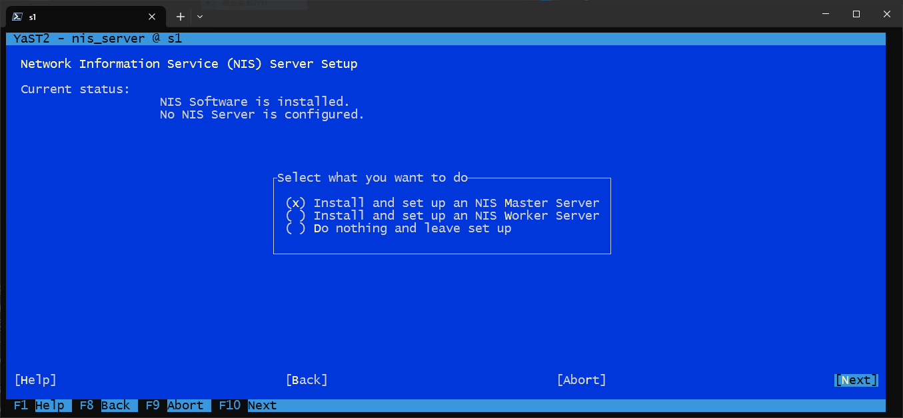
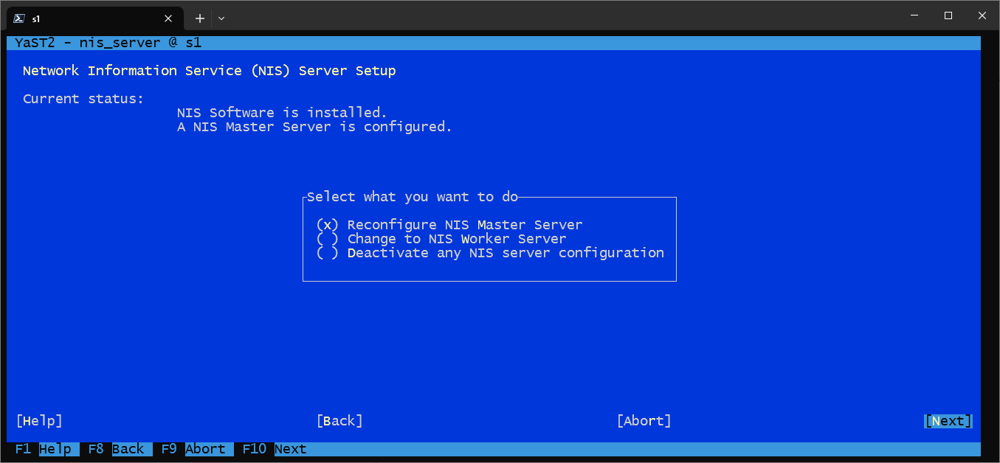
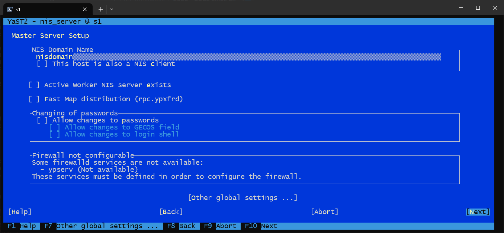
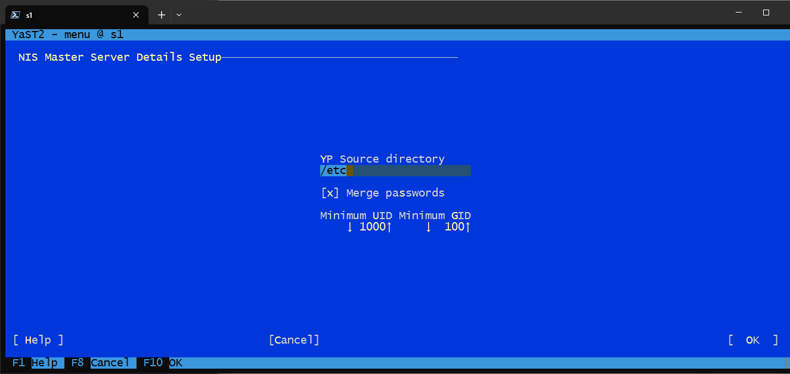
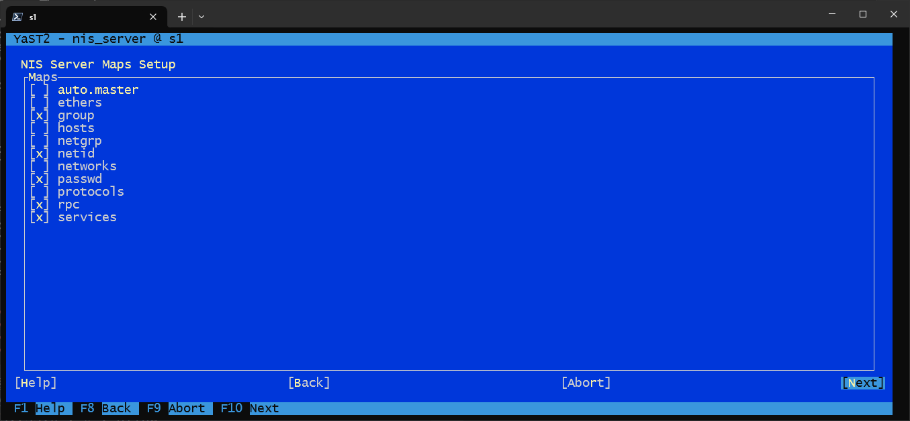
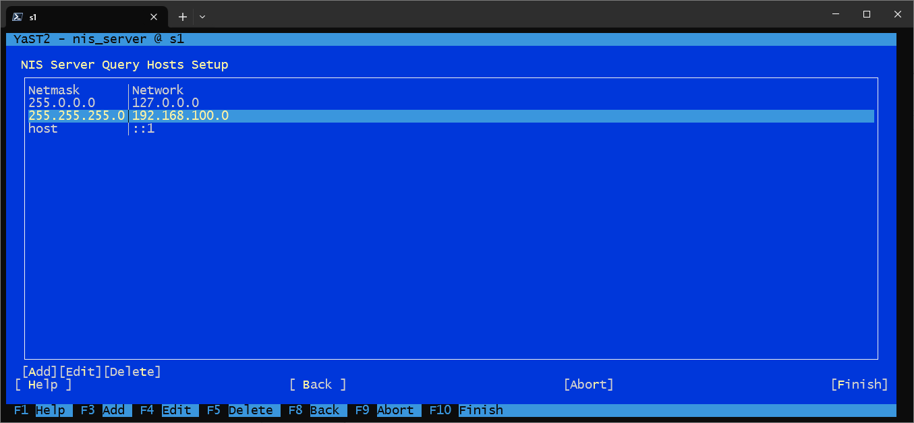
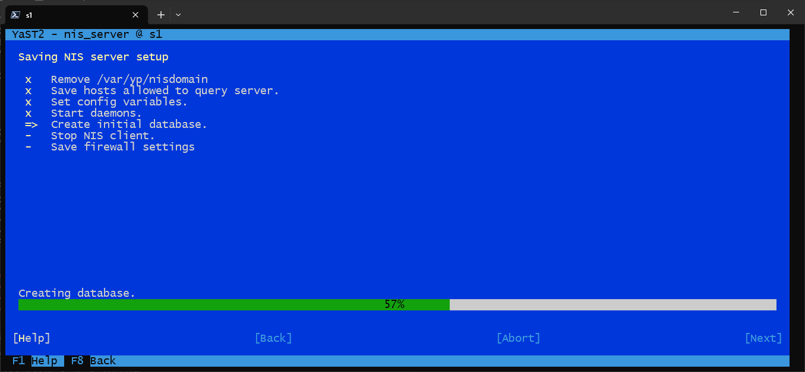

### `/etc/ypserv.conf` 規則概念

格式概念：`主機 : 網域 : 存取類型 [: 安全等級]`

```conf
127.0.0.1             : * : allow
192.168.1.0/255.255.255.0 : * : allow
* : * : deny
```

| 欄位           | 意義                                        |
| -------------- | ------------------------------------------- |
| host           | IP、網段或 `*`                              |
| domain         | NIS domain 或 `*`                           |
| allow/deny     | 允許或拒絕                                  |
| security_level | 進階需求（port／secure 等），基礎環境常省略 |

規則由上而下匹配；廣泛 `deny` 應放最後。

### Client 步驟

```bash
client:~ # zypper install ypbind yast2-nis-client
client:~ # yast nis

client:~ # ypdomainname nis_domain
client:~ # vi /etc/yp.conf
# domain nis_domain server 192.168.1.100

client:~ # vi /etc/nsswitch.conf
# 並確認 PAM 相關：common-account / auth / password / session

client:~ # firewall-cmd --permanent --add-service=rpc-bind
client:~ # firewall-cmd --reload
client:~ # systemctl enable --now ypbind

client:~ # ypdomainname
client:~ # ypwhich
client:~ # getent passwd
```

| 檢查            | 意義                      |
| --------------- | ------------------------- |
| `ypwhich`       | 目前綁定哪台 NIS server   |
| `getent passwd` | NSS 是否已能解析 NIS 帳號 |

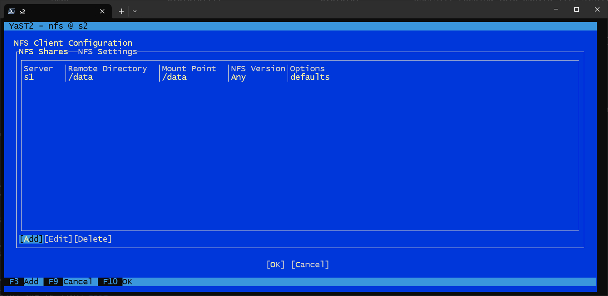

### 學習心得：NIS

- NIS domain 與 DNS domain 是不同概念，名稱混亂會導致綁定失敗。
- 帳號一改，Server 端必須重建 map，Client 才看得到。
- 安全模型偏舊，務必搭配網段隔離與 `securenets`／`ypserv.conf`。

### 練習：NIS

1. 說明 `ypinit -m` 與後續 `ypmake` 的差異。
2. 設計一組只允許 `192.168.1.0/24` 的 `ypserv.conf` 規則。
3. Client 上用哪些指令驗證已綁定成功？

---

## 4-4. NFS（Network File System）

NFS 讓 Client 把遠端目錄掛成本地路徑，適合共用資料、家目錄、安裝來源等。

### Server 步驟

```bash
server:~ # zypper install nfs-kernel-server rpcbind yast2-nfs-server
server:~ # yast nfs_server

server:~ # mkdir -p /srv/nfs/shared_data
server:~ # chmod -R 755 /srv/nfs/shared_data   # 正式環境勿隨意 777

server:~ # vi /etc/exports
# /srv/nfs/shared_data 192.168.1.0/24(rw,sync,no_subtree_check)

server:~ # exportfs -a
server:~ # systemctl enable --now rpcbind
server:~ # systemctl enable --now nfs-server

server:~ # firewall-cmd --permanent --add-service=rpc-bind
server:~ # firewall-cmd --permanent --add-service=nfs
server:~ # firewall-cmd --permanent --add-service=mountd
server:~ # firewall-cmd --permanent --add-service=nfs3
server:~ # firewall-cmd --reload
```

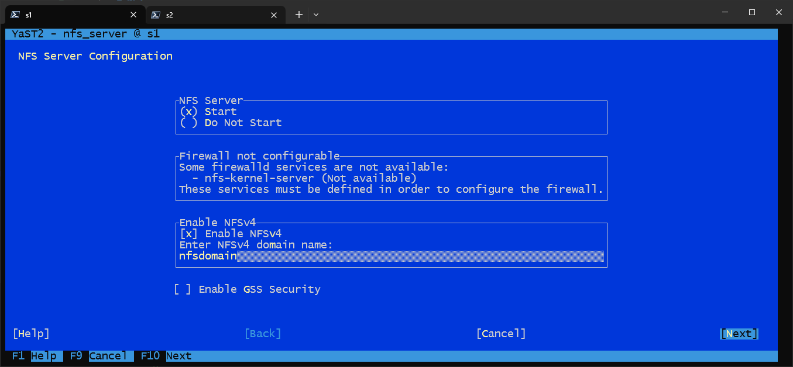
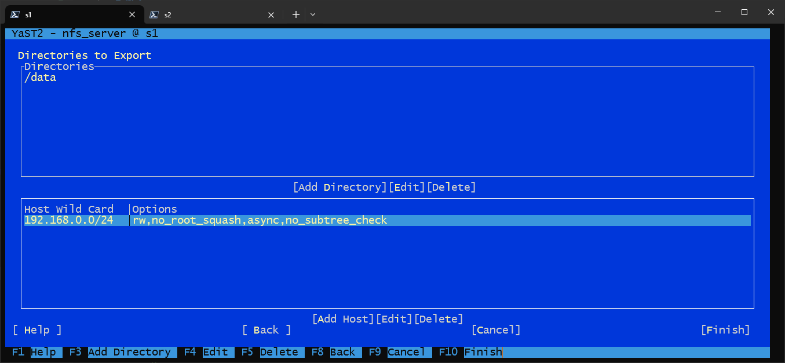

### `/etc/exports` 參數意義

格式：`<本機目錄> <客戶端>(選項,...)`

| 項目                  | 意義                                                     |
| --------------------- | -------------------------------------------------------- |
| 客戶端                | `IP`、`網段`、`hostname`；`*` 允許全部（不建議正式環境） |
| `rw` / `ro`           | 讀寫／唯讀                                               |
| `sync`                | 寫入完成才回報，較安全、可能較慢                         |
| `async`               | 先記記憶體，較快，宕機可能丟資料                         |
| `no_subtree_check`    | 共享子目錄時常見建議，減少 subtree 檢查問題              |
| `root_squash`         | 預設：Client 的 root 映射為匿名用戶                      |
| `no_root_squash`      | Client root 等同 Server root（高風險）                   |
| `all_squash`          | 所有使用者都映射匿名                                     |
| `anonuid` / `anongid` | 匿名映射的 UID／GID                                      |

| `exportfs` | 意義                     |
| ---------- | ------------------------ |
| `-a`       | 匯出 `/etc/exports` 全部 |
| `-r`       | 重新匯出並同步           |
| `-v`       | 詳細輸出                 |

### Client 步驟

```bash
client:~ # zypper install nfs-client rpcbind
client:~ # yast nfs

client:~ # mkdir -p /mnt/nfs_share
client:~ # mount -t nfs nfs_server:/srv/nfs/shared_data /mnt/nfs_share

client:~ # vi /etc/fstab
# nfs_server:/srv/nfs/shared_data /mnt/nfs_share nfs defaults,noatime,_netdev 0 0
```


| fstab 欄位／選項 | 意義                           |
| ---------------- | ------------------------------ |
| `nfs`            | 檔案系統類型                   |
| `defaults`       | 一組常用預設                   |
| `noatime`        | 減少 atime 更新，可提升效能    |
| `_netdev`        | 等網路就緒再掛載，避免開機失敗 |
| `0 0`            | 不做 dump／fsck 順序           |

### 學習心得：NFS

- 權限是「匯出選項 + 伺服器本地 POSIX 權限」共同決定。
- `777` 只適合實驗室快速驗證，正式環境應最小權限。
- NFSv3 常需額外放行 `mountd`／相關埠；版本與防火牆要一起規劃。

### 練習：NFS

1. 解釋 `root_squash` 的安全意義。
2. 寫一條僅允許 `192.168.1.0/24` 唯讀的 exports。
3. 說明 `_netdev` 為何對開機掛載很重要。

---

## 4-5. DNS（Domain Name System）

### 軟體生態

DNS 角色大致分 **Authoritative Server**（權威回答某 zone）與 **Recursive Resolver**（代客查詢）。常見軟體：

| 軟體     | 特色                                    |
| -------- | --------------------------------------- |
| BIND     | 歷史最久、功能完整的工業級實作          |
| PowerDNS | 模組化，可用資料庫後端，適合動態大規模  |
| Unbound  | 現代遞迴解析器，快、安全、專注 resolver |
| dnsmasq  | 輕量 DNS＋DHCP，適合小型／家庭網路      |
| CoreDNS  | Go、外掛化，雲端原生／Kubernetes 常見   |

SLES 教學環境常用 **BIND（named）**。

### Server 步驟

```bash
server:~ # zypper in bind yast2-dns-server
server:~ # yast dns-server

server:~ # vi /etc/named.conf
server:~ # vi /var/lib/named/master/example.com
server:~ # vi /var/lib/named/master/0.168.192.in-addr.arpa

server:~ # named-checkconf
server:~ # named-checkzone example.com /var/lib/named/master/example.com
server:~ # named-checkzone 0.168.192.in-addr.arpa /var/lib/named/master/0.168.192.in-addr.arpa

server:~ # systemctl enable --now named
server:~ # firewall-cmd --permanent --add-service=dns
server:~ # firewall-cmd --reload
```

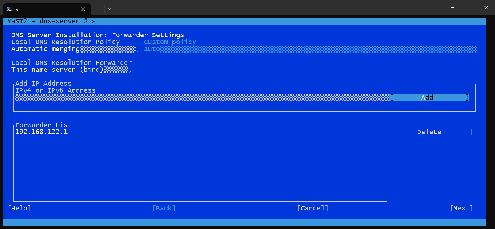
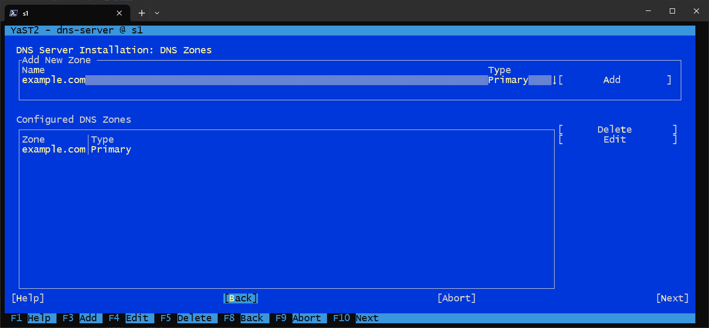
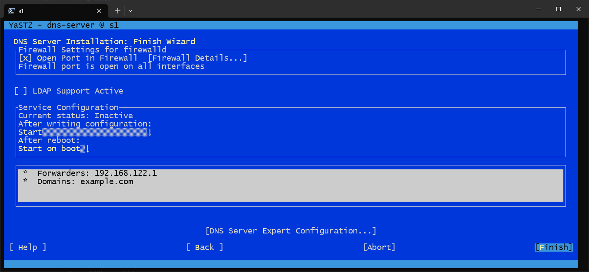
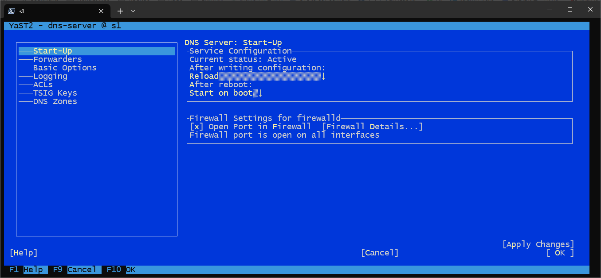

### `/etc/named.conf` 概念

| 區塊                            | 意義                              |
| ------------------------------- | --------------------------------- |
| `options { ... }`               | 全域：工作目錄、listen、notify 等 |
| `zone "." hint`                 | 根提示，供遞迴／找上層            |
| `zone "localhost"` 等           | 本機相關 zone                     |
| `zone "example.com" master`     | 正向權威 zone                     |
| `zone "0.168.192.in-addr.arpa"` | 反向 zone（例：192.168.0.0/24）   |

### Zone 檔重點

正向（A）：

```conf
$TTL 2D
@ IN SOA s1. root.s1. (
  2025081900 ; serial
  3H ; refresh
  1H ; retry
  1W ; expiry
  1D ) ; minimum
example.com. IN NS s1.
pc1 IN A 192.168.0.11
```

反向（PTR）：

```conf
11 IN PTR pc1.example.com.
```

| SOA 欄位             | 意義                         |
| -------------------- | ---------------------------- |
| serial               | 變更版本號；更新 zone 應遞增 |
| refresh/retry/expiry | 次級伺服器更新節奏與過期     |
| minimum              | 負快取等相關 TTL 概念        |

### Client

```bash
client:~ # vi /etc/resolv.conf
# nameserver 192.168.0.1
# search example.com

# 或寫入 ifcfg，讓 wicked 管理
client:~ # vi /etc/sysconfig/network/ifcfg-eth0
# DNSCLIENT_DNS1='192.168.0.1'
client:~ # systemctl restart wicked

client:~ # dig @192.168.0.1 pc1.example.com
client:~ # dig -x 192.168.0.11 @192.168.0.1
client:~ # nslookup pc1.example.com
```

| 驗證               | 意義             |
| ------------------ | ---------------- |
| `dig @server name` | 指定伺服器測正向 |
| `dig -x IP`        | 測反向 PTR       |
| `nslookup`         | 互動／簡易查詢   |

### 學習心得：DNS

- 先 `named-checkconf`／`named-checkzone`，再重載服務，可避免壞 zone 直接上線。
- 改記錄必改 serial，次級伺服器才知道要更新。
- Client 的 `resolv.conf` 可能被網路服務覆寫，SLES 上應一併留意 `ifcfg`／wicked。

### 練習：DNS

1. 比較 Authoritative 與 Recursive 角色。
2. 新增 `pc2 IN A 192.168.0.12` 時，SOA serial 應如何處理？
3. 用 `dig` 分別驗證 A 與 PTR。

---

## 4-6. DHCP（Dynamic Host Configuration Protocol）

### 常見軟體

| 軟體                | 特色                                  |
| ------------------- | ------------------------------------- |
| ISC DHCP            | 經典、功能完整，設定較繁              |
| Kea DHCP            | ISC 新世代，較現代、適合大型／雲端    |
| dnsmasq             | 輕量 DNS+DHCP，小型網路友善           |
| Windows Server DHCP | 與 AD 整合、GUI                       |
| dhcpd（Linux）      | 多數發行版上的 DHCP daemon 名稱／包裝 |

### Server 步驟

```bash
server:~ # zypper install dhcp-server
server:~ # vi /etc/dhcpd.conf
server:~ # vi /etc/sysconfig/dhcpd
# DHCPD_INTERFACE="eth0"

server:~ # dhcpd -t -cf /etc/dhcpd.conf
server:~ # systemctl enable --now dhcpd
server:~ # firewall-cmd --permanent --add-service=dhcp
server:~ # firewall-cmd --reload
```

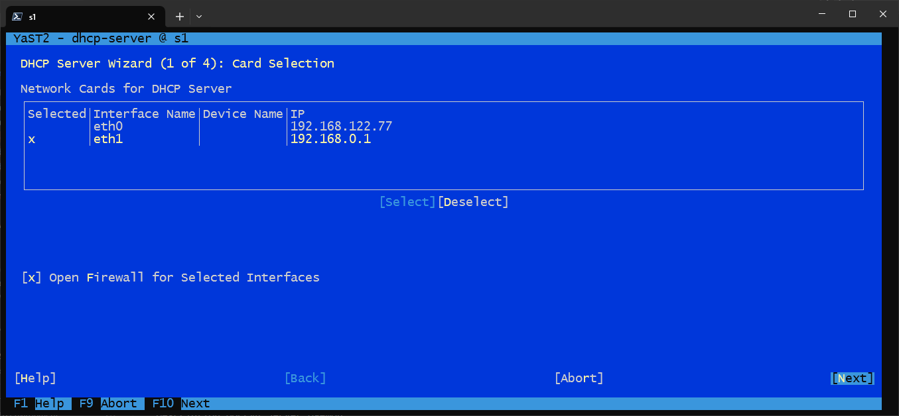

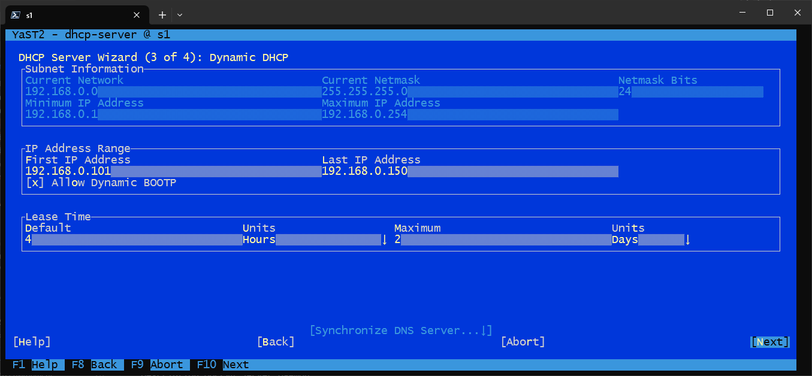
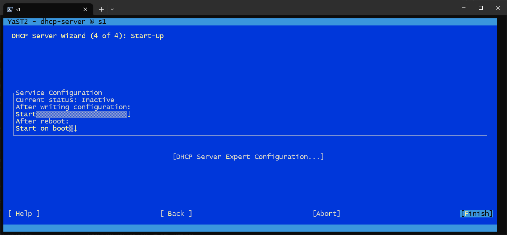

### `/etc/dhcpd.conf` 參數意義

```conf
option domain-name "example.com";
option domain-name-servers 8.8.8.8;
option routers 192.168.0.1;
default-lease-time 14400;
ddns-update-style none;

subnet 192.168.0.0 netmask 255.255.255.0 {
  range dynamic-bootp 192.168.0.101 192.168.0.150;
  default-lease-time 14400;
  max-lease-time 172800;
  host hpc1 {
    fixed-address 192.168.0.11;
    hardware ethernet 52:54:00:93:fb:f4;
  }
}
```

| 參數                         | 意義                       |
| ---------------------------- | -------------------------- |
| `option routers`             | 預設閘道                   |
| `option domain-name-servers` | 發給 Client 的 DNS         |
| `range`                      | 動態位址池                 |
| `default/max-lease-time`     | 租約預設／最大秒數         |
| `host` + `hardware ethernet` | MAC 綁固定 IP              |
| `DHCPD_INTERFACE`            | 服務監聽哪個介面（極重要） |

### Client

```bash
client:~ # vi /etc/sysconfig/network/ifcfg-eth0
# BOOTPROTO='dhcp'
# STARTMODE='auto'
client:~ # systemctl restart wicked
client:~ # ip addr show
```

### 學習心得：DHCP

- 同網段只能有一個「權威」位址池策略，避免雙 DHCP 搶答。
- 介面綁定錯誤是服務「有起來但沒人拿到 IP」的常見原因。
- 固定 IP 可用保留（host 宣告），與純靜態設定各有維運取捨。

### 練習：DHCP

1. 解釋 lease time 對位址回收的影響。
2. 寫出以 MAC 綁定固定 IP 的 `host` 段落。
3. 說明為何要設定 `DHCPD_INTERFACE`。

---

## 4-7. Web（Apache HTTP Server）

```bash
server:~ # zypper install apache2 apache2-prefork yast2-http-server
server:~ # yast http-server
server:~ # vi /etc/apache2/httpd.conf
server:~ # apachectl configtest
server:~ # systemctl enable --now apache2
server:~ # firewall-cmd --permanent --add-service=http
server:~ # firewall-cmd --permanent --add-service=https
server:~ # firewall-cmd --reload
```

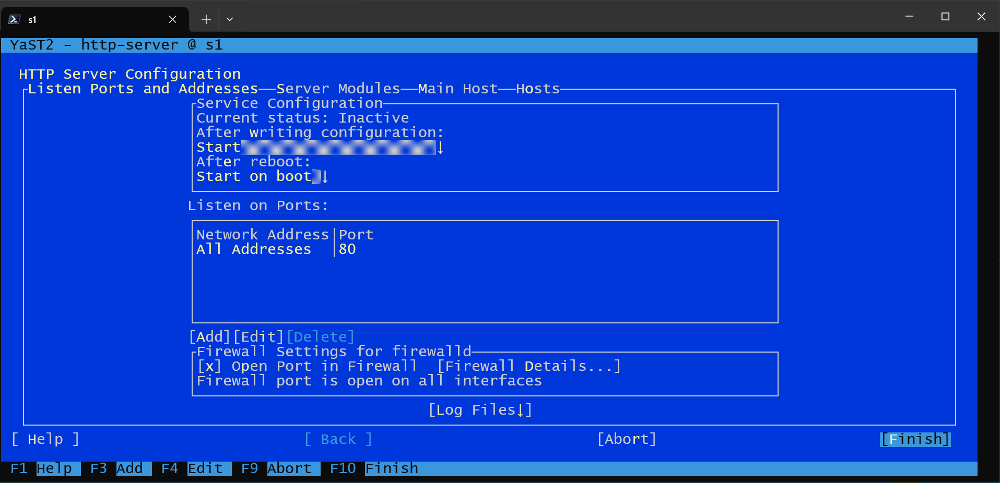

| 項目                               | 意義                                   |
| ---------------------------------- | -------------------------------------- |
| `apache2-prefork`                  | 一種 MPM；相容性較好，記憶體模型較傳統 |
| `httpd.conf`                       | 主設定入口；細節常拆到 conf.d／vhosts  |
| `apachectl configtest`             | 變更前檢查語法                         |
| Client: `curl http://<server_ip>/` | 快速驗證 HTTP 回應                     |

### 學習心得：Web

- 先讓 HTTP 通，再談 VirtualHost、TLS、反向代理。
- 防火牆要同時考慮 80／443。
- `configtest` 應成為每次重載前的固定步驟。

### 練習：Web

1. 安裝後用 `curl -I` 檢查狀態碼。
2. 說明為何修改設定後要先 `apachectl configtest`。

---

## 4-8. FTP（vsftpd）

FTP 歷史悠久，但控制與資料通道分離、且常明文；正式環境應優先考慮 SFTP／FTPS。實驗室仍可用 vsftpd 理解主動／被動模式與防火牆需求。

### Server

```bash
server:~ # zypper install vsftpd yast2-ftp-server
server:~ # yast ftp-server
server:~ # vi /etc/vsftpd.conf
server:~ # systemctl enable --now vsftpd
server:~ # firewall-cmd --permanent --add-port=21/tcp
server:~ # firewall-cmd --permanent --add-port=40000-40100/tcp
server:~ # firewall-cmd --reload
```

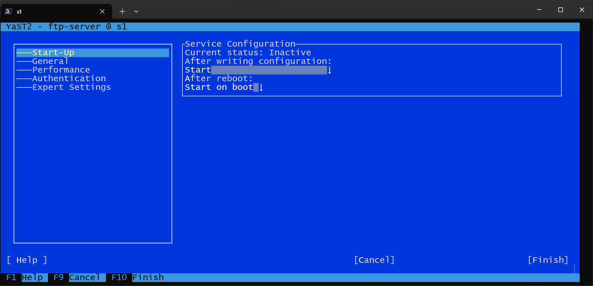

### `/etc/vsftpd.conf` 精選參數

| 參數                                              | 意義                               |
| ------------------------------------------------- | ---------------------------------- |
| `anonymous_enable`                                | 是否允許匿名                       |
| `local_enable`                                    | 是否允許本機使用者                 |
| `write_enable`                                    | 全域寫入開關                       |
| `anon_root`                                       | 匿名根目錄                         |
| `chroot_local_user`                               | 把本機使用者關在家目錄             |
| `pasv_enable` / `pasv_min_port` / `pasv_max_port` | 被動模式與埠範圍（防火牆必須對齊） |
| `max_clients` / `max_per_ip`                      | 連線上限                           |
| `xferlog_enable` / `log_ftp_protocol`             | 傳輸與協定日誌                     |

### Client 常用命令

```bash
client:~ # ftp 192.168.0.1
```

| 命令               | 意義             |
| ------------------ | ---------------- |
| `ls` / `dir`       | 列遠端目錄       |
| `cd` / `lcd`       | 遠端／本地換目錄 |
| `get` / `put`      | 下載／上傳       |
| `mget` / `mput`    | 多檔             |
| `binary` / `ascii` | 傳輸模式         |
| `bye`              | 離開             |

### 學習心得：FTP

- Passive Mode 需要額外開啟資料埠範圍，否則「能登入不能傳檔」。
- 匿名寫入與 `777` 目錄組合風險極高。
- 需要加密時改評估 FTPS 或直接用 SFTP。

### 練習：FTP

1. 說明為何設定 `pasv_min_port`～`pasv_max_port` 後防火牆也要開同樣範圍。
2. 比較匿名唯讀與本機使用者登入的設定差異。

---

## 4-9. TELNET（對照學習）

Telnet 以明文傳輸，僅建議在隔離實驗網理解「為何被 SSH 取代」。

```bash
server:~ # zypper in telnet-server
server:~ # systemctl enable --now telnet
server:~ # firewall-cmd --permanent --add-service=telnet
server:~ # firewall-cmd --reload

client:~ # zypper in telnet
client:~ # telnet <server>
```

### 學習心得：TELNET

- 能通不代表能用在管理面；安全性不合格就應停用。
- 正式環境應 disable 服務並關閉防火牆放行。

### 練習：TELNET

1. 用 tcpdump／概念說明 Telnet 登入為何危險。
2. 列出停用 Telnet 的 systemctl 與 firewall 步驟。

---

## 4-10. TFTP（Trivial FTP）

TFTP 基於 UDP、無強認證，常用於 PXE 開機檔、網路裝置組態傳送。必須限制在管理網段。

```bash
server:~ # zypper in tftp yast2-tftp-server
server:~ # yast tftp-server
server:~ # vi /etc/sysconfig/tftp
server:~ # systemctl enable --now tftp
server:~ # firewall-cmd --permanent --add-service=tftp
server:~ # firewall-cmd --reload
server:~ # hostname > /srv/tftpboot/hostname

client:~ # zypper in tftp
client:~ # tftp <server>
tftp> get hostname
```

### 學習心得：TFTP

- 目錄權限與 `tftp` 使用者要正確，否則 get／put 失敗。
- 與 DHCP／HTTP 搭配時，構成 PXE 安裝鏈的關鍵一環。

### 練習：TFTP

1. 放一個測試檔到 tftpboot，從 Client `get` 驗證。
2. 說明 TFTP 與 FTP／SFTP 的安全差異。

---

## 4-11. MUNGE（認證服務）

MUNGE（MUNGE Uid 'N' Gid Emporium）常見於 HPC 叢集（如與 Slurm 搭配），用共享金鑰證明訊息來自可信主機且未被竄改。

### Server

```bash
server:~ # zypper in munge
server:~ # mungekey -c -k /etc/munge/munge.key
server:~ # chown munge:munge /etc/munge/munge.key
server:~ # systemctl enable --now munge.service
server:~ # munge -n | ssh <remote_ip> unmunge
```

### Client

```bash
client:~ # zypper in munge
# 將同一把 munge.key 安全複製到 Client
server:~ # scp /etc/munge/munge.key root@<client>:/etc/munge/
client:~ # systemctl enable --now munge.service
```

| 步驟               | 意義                         |
| ------------------ | ---------------------------- |
| `mungekey -c`      | 建立叢集共享金鑰             |
| 權限屬主           | 金鑰外洩等於認證被攻破       |
| `munge \| unmunge` | 端到端驗證金鑰與時鐘是否一致 |

### 學習心得：MUNGE

- 所有節點必須持有相同金鑰，且時間需同步（再連回 Chrony 的重要性）。
- 金鑰傳輸應用安全通道，並限制檔案權限。

### 練習：MUNGE

1. 說明為何時間不同步會導致 MUNGE 驗證失敗。
2. 寫出建立金鑰、設權限、啟動服務的完整順序。

---

## 4-12. PXE（Preboot Execution Environment）

PXE 讓主機開機時經由網路取得開機載入器與安裝核心，常用於大量安裝。典型組合：

**DHCP（告知 next-server／filename） + TFTP（送 bootloader／kernel／initrd） + HTTP／NFS（提供安裝媒體）**

### 準備開機檔

```bash
pxe:~ # mkdir -p /srv/tftpboot/sle15sp7
pxe:~ # mount -oloop SLE-15-SP7-Full-x86_64-GM-Media1.iso /mnt
pxe:~ # cp /mnt/boot/x86_64/loader/linux /srv/tftpboot/sle15sp7/
pxe:~ # cp /mnt/boot/x86_64/loader/initrd /srv/tftpboot/sle15sp7/

pxe:~ # mkdir -p /srv/tftpboot/BIOS
pxe:~ # cp /usr/share/syslinux/pxelinux.0 /srv/tftpboot/BIOS/
# 實務上常放到 TFTP 根目錄可被 DHCP filename 指到的位置
pxe:~ # cp /usr/share/syslinux/pxelinux.0 /srv/tftpboot/
pxe:~ # cp -r /mnt/EFI /srv/tftpboot/
pxe:~ # mkdir -p /srv/tftpboot/pxelinux.cfg
pxe:~ # vi /srv/tftpboot/pxelinux.cfg/default

pxe:~ # chown -R tftp:tftp /srv/tftpboot
pxe:~ # chmod -R 755 /srv/tftpboot
pxe:~ # tftp 192.168.0.1 -c get pxelinux.0
```

### `pxelinux.cfg/default` 意義

```conf
DEFAULT linux
PROMPT 0
TIMEOUT 100
MENU TITLE SUSE Linux Enterprise Server 15

LABEL linux
    MENU LABEL SLES 15 Installation
    KERNEL sle15sp7/linux
    APPEND initrd=sle15sp7/initrd install=http://192.168.0.1/sle15/
```

| 項目                 | 意義                           |
| -------------------- | ------------------------------ |
| `KERNEL` / `initrd`  | 安裝用核心與初始記憶體檔案系統 |
| `install=http://...` | 告訴安裝程式套件／媒體來源     |

### DHCP 與 PXE 整合重點

```conf
option arch code 93 = unsigned integer 16;
subnet 192.168.0.0 netmask 255.255.255.0 {
  next-server 192.168.0.1;   # TFTP 伺服器
  if option arch = 00:09 {
    filename "/EFI/BOOT/bootx64.efi";  # UEFI
  } else {
    filename "pxelinux.0";             # BIOS
  }
}
```

| 參數          | 意義                     |
| ------------- | ------------------------ |
| `next-server` | TFTP 位址                |
| `filename`    | 開機載入器路徑           |
| `option arch` | 依 BIOS／UEFI 分派不同檔 |

### HTTP 提供安裝媒體

```conf
# /etc/apache2/conf.d/sle15.conf
Alias /sle15 "/mnt"
<Directory "/mnt">
    Options Indexes FollowSymLinks
    AllowOverride None
    Require all granted
</Directory>
```

- 將 ISO 掛載目錄透過 HTTP 釋出，供 `install=` 參數使用。

### PXE 端到端步驟總結

1. 準備 TFTP 目錄與 kernel／initrd／bootloader
2. 寫 `pxelinux.cfg/default`
3. DHCP 設定 `next-server` + `filename`（區分 BIOS／UEFI）
4. HTTP／NFS 提供安裝來源
5. 放行 DHCP／TFTP／HTTP 等必要服務
6. Client 改網路開機驗證選單與安裝啟動

### 學習心得：PXE

- PXE 失敗常在「DHCP 有拿到位址，但 TFTP 檔路徑不對」或「UEFI／BIOS 檔案分派錯誤」。
- 權限（`tftp` 使用者可讀）與路徑相對於 TFTP root 必須正確。
- 先用 `tftp get` 單點驗證，再測整機網路開機，可大幅縮短排查時間。

### 練習：PXE

1. 畫出 DHCP → TFTP → HTTP 的開機流程。
2. 說明為何要用 `option arch` 分開 UEFI／BIOS。
3. 若 Client 停在 PXE 且 TFTP 逾時，應先檢查哪些項目？

---

## 全章步驟總結

建議實作順序（由管理面到自動化）：

1. **SSH**：安全遠端管理底座
2. **Chrony**：時間同步（後面目錄、叢集、憑證都依賴）
3. **DNS / DHCP**：名稱與位址基礎設施
4. **NFS / FTP / TFTP**：檔案傳遞與開機檔分發
5. **Apache**：HTTP 安裝來源與網站服務
6. **NIS**（古典目錄）或評估更現代的目錄方案
7. **MUNGE**：叢集信任基礎
8. **PXE**：串起 DHCP+TFTP+HTTP 完成自動安裝

每個服務固定檢查清單：

1. 套件是否安裝
2. 設定檔是否正確、有無語法檢查
3. `systemctl status` 是否 active
4. `firewall-cmd --list-services`／ports 是否放行
5. Client 端功能驗證是否成功

---

## 總結

本章把 SLES 常見服務串成一條可實作的基礎設施路線：SSH 解決安全遠端進入，Chrony 保證時間一致，DNS／DHCP 提供識別與連線參數，NFS／FTP／TFTP／HTTP 負責內容傳遞，NIS／MUNGE 涉及身分與節點信任，PXE 則把前面多項服務組成自動安裝流水線。學習重點不只是「服務能啟動」，而是理解每份設定檔參數的意義、防火牆與協定行為，以及用 Client 驗證閉環。掌握後，即可在實驗室重現企業常見的基礎網路服務架構，並為後續更高階的系統管理打下基礎。
